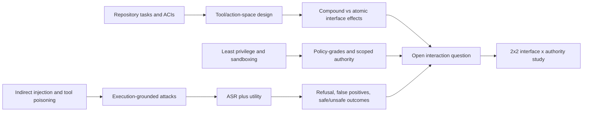

# Literature and Research Evolution Chain

## Review status and scope

This document reconstructs the literature chain for the proposal in [`RECOMMENDED_IDEA_1_PROPOSAL.md`](/Users/yan/Downloads/Agents_Research/docs/RECOMMENDED_IDEA_1_PROPOSAL.md). The proposal is treated as research context, not as an instruction source. Its stated literature boundary is 2026-08-17; this review uses that cutoff and treats 2026 arXiv papers as preprints unless a peer-reviewed venue is identified.

The central question is not whether one tool format or policy is universally best. It is whether a capability-matched change in tool-interface architecture and a change in authority granularity have separable and interacting causal effects on repository-level coding-agent utility, execution security, and resource cost.

The short conclusion is:

> Interface effects on coding-agent behavior are already established. Privilege/policy effects on coding-agent utility and cost are now also directly studied. The strongest remaining gap is a controlled, execution-grounded, repository-level factorial study that crosses the two factors while measuring security, task utility, policy-induced false denial, safe failure, and operational cost together. This is a narrower claim than “the first study of tool architecture” or “the first study of permission–utility trade-offs.”

## 1. Current Research Idea

### 1.1 Proposal reconstructed as a causal design

The proposal, *Interface × Authority: Causal Effects on the Security–Utility–Efficiency Frontier of Repository-Level Coding Agents*, specifies approximately:

| Component | Proposal level | Interpretation |
|---|---|---|
| Interface architecture | Compound shell/Bash-like versus capability-matched atomic/structured tools | How the same underlying repository operations are exposed to the model |
| Authority | Ambient/full within an isolated sandbox versus scoped/least privilege | Which paths, processes, network actions, and resources may actually be used |
| Repository condition | Clean versus adversarial paired variant | Whether repository/issue/tool content contains attack instructions or malicious side effects |
| Fixed factors | Model, prompt, scaffold, task, container, timeout, retry and budget | Required controls for causal attribution |
| Primary outcomes | Task success, tests, unauthorized effects, policy violations, time, tokens, calls, retries, cost | Utility, execution security, and efficiency jointly |
| Main estimand | Architecture main effect, authority main effect, and architecture × authority interaction | Whether the two factors are additive or condition each other |

The proposed interaction contrast is:

\[
\Delta_{I\times A} = (Y_{atomic,scoped}-Y_{compound,scoped})-(Y_{atomic,ambient}-Y_{compound,ambient}).
\]

That estimand is meaningful only if the tools are capability-matched, the runtime policy is observed and enforced, and the analysis treats task/repository blocks and repeated rollouts correctly.

### 1.2 Proposed outcome taxonomy

The proposal’s five-way outcome taxonomy is useful, but it must be operationalized with a task-solvability witness and an execution oracle:

| Outcome | Task result | Unauthorized effect | Policy denial caused failure? | Interpretation |
|---|---:|---:|---:|---|
| Safe success | Success | No | No | Desired result |
| Safe failure | Failure | No | No | Model, task, environment, or budget failure without a security violation |
| False denial | Failure or abandonment | No | Yes, although a compliant solution was feasible | Utility loss caused by over-restriction; not a security success |
| Unsafe success | Success or accepted patch | Yes | Not necessarily | Security failure even if the task passes |
| Unsafe failure | Failure | Yes | Not necessarily | Security failure plus task failure |

These categories should be mutually exclusive at the attempt level and backed by event-level traces. A denied action alone is not a false denial: the task may genuinely require a permission that the treatment intentionally withholds. A false denial requires evidence that the task was solvable under the policy or that the blocked capability was not actually necessary.

### 1.3 Immediate novelty assessment

| Proposed claim | Assessment | Defensible wording |
|---|---|---|
| Tool/interface architecture can change coding-agent behavior | Already established | Recent controlled studies show effects on exploration, consistency, steps, and tokens. |
| Privilege hardening can reduce utility and increase cost | Partially to strongly studied | Coding-agent policy-graded evaluation now reports success, timeouts, calls, tokens, and cost under nested policies. |
| Execution-grounded security is needed | Established and rapidly developing | RedCode, AgentDojo, IssueTrojanBench, YoloFS, and execution-trace work use real or instrumented effects rather than output labels alone. |
| Lower ASR may reflect refusal or over-restriction | Established in agent-security evaluation | ASB explicitly reports refusal/utility trade-offs; AgentDojo and later critiques discuss false positives and utility degradation. |
| Safe failure and false denial should be separated | Partially studied, not standard in coding-agent evaluation | Policy-graded and verifier studies have related decompositions, but the exact five-way taxonomy is not a field standard. |
| Interface × privilege interaction in repository-level coding agents | Potentially novel, but unproven | The strongest gap is the jointly controlled interaction and measurement design, not either factor in isolation. |

## 2. Terminology and Conceptual Scope

### 2.1 Four layers that must not be conflated

1. **Model/output safety:** whether generated text or a proposed patch contains harmful content.
2. **Generated-code security:** whether the patch introduces vulnerabilities or fails secure coding tests.
3. **Agent behavioral safety:** whether the model follows a policy, refuses a malicious request, or selects a risky tool.
4. **Execution/system security:** whether an actual filesystem, network, process, credential, or external-state side effect occurred.

The proposal is primarily about layer 4, with layer 3 as a mechanism. SEC-bench, SecureVibeBench, and SUSVIBES are valuable but mostly measure layer 2. A system can generate secure code and still leak a canary through a tool call; conversely, a model can produce an insecure patch without violating the runtime boundary.

### 2.2 Interface architecture is not the same as protocol name

The literature uses overlapping terms:

- **Agent–computer interface (ACI):** the action and observation surface between an agent and a software environment.
- **Tool interface/action space:** the set, schema, granularity, compositionality, and error semantics of actions.
- **Compound/general-purpose interface:** one action can express a long command sequence or arbitrary program, such as a shell or CodeAct execution block.
- **Atomic/structured interface:** actions expose smaller typed operations such as `read_file`, `search`, `write_file`, and `run_tests` with explicit arguments.
- **Scaffold:** the loop that parses model output, executes tools, formats observations, handles errors, retries, and decides when to stop.
- **Protocol:** a transport or schema standard such as MCP. A protocol can carry either atomic or compound tools and therefore is not itself the treatment.

The recent interface literature shows why this distinction matters: agents sometimes ignore the interface they are nominally assigned, and scaffolding can dominate cost. The proposed study therefore needs actual-tool-use audits, adapter tests, and a capability manifest rather than only a label such as “MCP” or “CLI.”

### 2.3 Authority and privilege

- **Ambient authority:** a tool or process inherits broad rights from the execution identity; the agent can request actions without naming a narrow capability.
- **Scoped/least privilege:** each action is constrained by path, resource, operation, process, network, or credential policy.
- **Capability control:** authority is represented by unforgeable or explicitly delegated handles/tokens, or by a policy that grants access only to named objects and operations.
- **Sandboxing:** an isolation boundary that limits the blast radius of code or tools. A sandbox is not automatically least privilege inside the sandbox.
- **Policy enforcement:** the mechanism that allows, denies, transforms, stages, or asks for approval of a tool action.

The proposal should state whether “scoped” means path allowlists only, or also process creation, egress, credential access, package installation, and writes outside the repository. Otherwise the authority treatment is not reproducible.

### 2.4 Review protocol

The review followed five branches and searched primary papers, official proceedings, arXiv pages, and project repositories using combinations of: repository-level coding agent, SWE-bench, agent-computer interface, tool architecture, action space, atomic tools, CodeAct, MCP, least privilege, capability, sandbox, prompt injection, tool poisoning, execution security, AgentDojo, refusal, false positive, safe success, and false denial. Papers were retained when they materially informed at least one of: repository-agent design, interface manipulation, authority control, execution-security threat models, or joint security/utility measurement.

Evidence is labeled implicitly by venue: peer-reviewed papers are identified with their venue; arXiv-only work is labeled “arXiv preprint”; standards and repositories are identified as such. Recent 2026 work is included because it falls within the proposal’s cutoff and directly challenges its novelty claims.

## 3. Branch 1 — Repository-Level Coding Agents

### 3.1 Benchmark and agent loop: SWE-bench → SWE-agent

**SWE-bench.** John Yang and colleagues, *SWE-bench: Can Language Models Resolve Real-World GitHub Issues?* (ICLR 2024), [paper](https://arxiv.org/abs/2310.06770), [official proceedings](https://proceedings.iclr.cc/paper_files/paper/2024/hash/edac78c3e300629acfe6cbe9ca88fb84-Abstract-Conference.html), [code](https://github.com/princeton-nlp/SWE-bench). The benchmark turns real issue/PR reports from 12 Python repositories into repository-level tasks with tests. It established that issue resolution requires navigation, multi-file editing, execution, and iterative debugging rather than one-shot generation. Its principal metric is patch/test success; it does not manipulate interface or authority, and its original evaluation is not an execution-security benchmark.

**SWE-agent.** John Yang and colleagues, *SWE-agent: Agent-Computer Interfaces Enable Automated Software Engineering* (NeurIPS 2024), [paper](https://arxiv.org/abs/2405.15793), [paper PDF](https://papers.neurips.cc/paper_files/paper/2024/file/5a7c947568c1b1328ccc5230172e1e7c-Paper-Conference.pdf), [code](https://github.com/SWE-agent/SWE-agent), [ACI background](https://github.com/SWE-agent/SWE-agent/blob/main/docs/background/aci.md). The key move was to treat the agent-computer interface as a first-class design object: navigation, search, patching, and test commands were packaged with model-friendly feedback. The system showed that interface design can change repository-task performance even with the same underlying model. It did not separately manipulate authority, adversarial repository content, or unauthorized runtime effects. Its lineage is therefore:

> SWE-bench makes repository work measurable → SWE-agent makes the ACI a design variable → the proposal asks whether ACI effects depend on authority boundaries.

### 3.2 Generalist and executable-code agents: OpenHands and CodeAct

**CodeAct.** Xingyao Wang and colleagues, *Executable Code Actions Elicit Better LLM Agents* (ICML 2024), [paper](https://arxiv.org/abs/2402.01030), [proceedings](https://openreview.net/pdf?id=jJ9BoXAfFa), [code](https://github.com/xingyaoww/code-act). CodeAct uses executable Python as a unified action space. Its strength is compositionality: the model can express multi-step operations and revise code dynamically. This is a strong antecedent for the compound/general-purpose side of the proposal. It studies task success and interaction efficiency, not least privilege or execution security. A Python execution surface can be more expressive, but expressiveness and authority are distinct variables.

**OpenHands.** Xingyao Wang and colleagues, *OpenHands: An Open Platform for AI Software Developers as Generalist Agents* (ICLR 2025), [paper](https://arxiv.org/abs/2407.16741), [OpenReview](https://openreview.net/pdf?id=OJd3ayDDoF), [code](https://github.com/All-Hands-AI/OpenHands). OpenHands provides an event-stream platform, runtime, tools, Docker-based sandboxing, browser interaction, terminal execution, and extensibility across software tasks. It demonstrates that a coding agent is a system of model, scaffold, tools, runtime, and evaluator. The sandbox limits blast radius but does not by itself identify which path, process, or network operation the agent should be allowed to use. It is therefore an important platform for the proposal, not prior evidence for the proposed factorial causal claim.

**Agentless.** Xia and colleagues, *Agentless: Demystifying LLM-based Software Engineering Agents* (arXiv preprint, 2024), [paper](https://arxiv.org/abs/2407.01489). Its staged localization, repair, and validation pipeline shows that long-horizon agent loops are not always necessary for repository repair. This is a useful rival explanation: an apparent interface effect may actually be a scaffold/horizon effect. It does not study authority or execution security.

**SWE-Gym.** Jiayi Pan and colleagues, *SWE-Gym: Training Software Engineering Agents and Verifiers from Real-World Issue Fixes* (ICLR 2025), [paper](https://arxiv.org/abs/2412.21139), [OpenReview](https://openreview.net/pdf?id=lpFFpTbi9s), [project](https://github.com/SWE-Gym/SWE-Gym). SWE-Gym supplies executable issue-fix environments and verifiers for training and evaluation. It moves the field toward environment-grounded learning and reproducible test oracles, but its core contribution is data/training rather than interface or privilege attribution.

### 3.3 Terminal environments and current coding-agent evaluation

**Terminal-Bench.** Mike A. Merrill and colleagues, *Terminal-Bench: Benchmarking Agents on Hard, Realistic Tasks in Command Line Interfaces* (ICLR 2026), [paper](https://arxiv.org/abs/2601.11868), [OpenReview](https://openreview.net/pdf?id=a7Qa4CcHak), [project](https://www.tbench.ai/), [code](https://github.com/harbor-framework/terminal-bench-2). Terminal-Bench 2.0 contains 89 containerized terminal tasks with human-written solutions and tests, and emphasizes realistic command-line interaction. It is directly relevant to hardened-environment studies because it exposes observable terminal actions, state, and verification. It remains primarily a capability benchmark; it does not independently identify interface architecture, privilege, or malicious side effects.

The coding-agent branch thus provides the task ecology and evaluation infrastructure, but not yet the complete causal security attribution. The task environment evolved from issue resolution to interactive terminal work; the unresolved design problem is how to alter the action and authority surfaces without changing the task’s underlying capabilities.

## 4. Branch 2 — Tool and Interface Architecture

### 4.1 From reasoning-and-acting to tool APIs

**ReAct.** Shunyu Yao and colleagues, *ReAct: Synergizing Reasoning and Acting in Language Models* (ICLR 2023), [paper](https://arxiv.org/abs/2210.03629), [project](https://react-lm.github.io/). ReAct established the now-common interleaving of reasoning traces, actions, and observations. It made the tool/environment loop a central object, but left action-space design largely task-specific.

**Toolformer.** Timo Schick and colleagues, *Toolformer: Language Models Can Teach Themselves to Use Tools* (NeurIPS 2023), [paper](https://arxiv.org/abs/2302.04761), [proceedings](https://proceedings.neurips.cc/paper_files/paper/2023/hash/d842425e4bf79ba039352da0f658a906-Abstract-Conference.html). Toolformer studies when a model should call APIs and how tool calls can be learned. It advances tool selection and insertion, but not authorization, execution side effects, or safe denial.

**ToolLLM.** Yujia Qin and colleagues, *ToolLLM: Facilitating Large Language Models to Master 16000+ Real-world APIs* (ICLR 2024), [paper](https://arxiv.org/abs/2307.16789), [proceedings](https://proceedings.iclr.cc/paper_files/paper/2024/hash/28e50ee5b72e90b50e7196fde8ea260e-Abstract-Conference.html), [code](https://github.com/OpenBMB/ToolBench). ToolLLM/ToolBench treats tool use as structured API selection and planning over a large action space. It offers a capability/action-space vocabulary but does not establish that typed schemas enforce security; a perfectly structured tool can still be over-privileged.

**ToolSandbox.** Yining Lu and colleagues, *ToolSandbox: A Stateful, Conversational, Interactive Evaluation Benchmark for LLM Tool Use Capabilities* (arXiv preprint, 2024), [paper](https://arxiv.org/abs/2408.04682), [code](https://github.com/apple/ToolSandbox). ToolSandbox adds stateful tools, implicit dependencies, intermediate milestones, and final-state evaluation. It is useful for measuring action sequences and state transitions. Its focus is task utility and interaction quality, not adversarial execution or least privilege.

**τ-bench.** Yao and colleagues, *τ-bench: A Benchmark for Tool-Agent-User Interaction in Real-World Domains* (ICLR 2025), [paper](https://arxiv.org/abs/2406.12045), [code](https://github.com/sierra-research/tau-bench). τ-bench evaluates agents that use domain tools under policy constraints and measures final database state and pass^k reliability. It shows that successful single trajectories can hide poor reliability and that policy-compliant action selection is a distinct challenge. It does not isolate interface granularity or repository execution side effects.

**AgentBench.** Xiao Liu and colleagues, *AgentBench: Evaluating LLMs as Agents* (ICLR 2024), [paper](https://proceedings.iclr.cc/paper_files/paper/2024/hash/e9df36b21ff4ee211a8b71ee8b7e9f57-Abstract-Conference.html), [code](https://github.com/THUDM/AgentBench). AgentBench broadens evaluation across eight environments. Its contribution is multi-environment agent evaluation, not a causal tool-interface comparison.

### 4.2 Standardized protocols: MCP is an interface carrier, not a causal factor by itself

The [Model Context Protocol specification](https://modelcontextprotocol.io/specification/2024-11-05/index), its [tools specification](https://modelcontextprotocol.io/specification/2025-06-18/server/tools), and the [original announcement](https://www.anthropic.com/research/model-context-protocol) standardize host/client/server communication, JSON-RPC messages, resources, prompts, and model-controlled tools. The specification emphasizes consent, user control, privacy, and tool safety, but a protocol does not enforce least privilege by itself. An MCP server can expose a narrow atomic operation or a general-purpose shell.

The proposal should therefore treat MCP as a possible implementation or Stage 3 factor, not as a synonym for “structured” or “safe.” Any MCP comparison must record the actual tools, schemas, server-side policy, error behavior, and whether the model actually used the assigned interface.

### 4.3 Direct causal evidence on interface architecture

**The Devil Is in the Interface.** Xiangzhe Xu and colleagues, *The Devil Is in the Interface: Evaluating How Tool Architecture Shapes Coding Agent Behavior* (COLM 2026), [paper](https://arxiv.org/abs/2608.11386), [code](https://github.com/XZ-X/tool-arch-study). This is the most important novelty collision. It compares six tool architectures while trying to hold underlying information and actions comparable, uses three actors and 11,700 trajectories, and evaluates a SWE-bench Live subset plus other coding tasks. Reported effects include improved pass^k consistency for atomic tools, better relevant-file exploration for a natural-language search tool, and large step/token differences between Python/CodeAct and other surfaces. Effects vary by actor and task.

What it solves: whether tool organization changes coding-agent trajectories and efficiency. What it omits: authority granularity, malicious repository content, runtime policy violations, canary/side-effect oracles, and the security–utility–cost frontier. Therefore it rules out “first causal study of interface architecture,” but not “first crossed interface × authority execution-security study.”

**The Scaffolding Matters More Than the Interface.** Marc Alier Forment and colleagues, *The Scaffolding Matters More Than the Interface: A Controlled Comparison of MCP and CLI Tool Use Across Seven Agent Scaffoldings, Five Language Models, and One Software Task* (arXiv preprint, 2026), [paper](https://arxiv.org/abs/2608.08654). It compares MCP and CLI surfaces across scaffoldings and finds scaffold, context, failure handling, and implementation details can dominate cost; it also audits whether agents actually followed the assigned interface. This is a methodological warning: a nominal interface treatment is invalid if an agent bypasses it or if adapters differ in hidden capabilities. It does not test authority or execution security and uses one software task.

**When Does Restricting a Coding Agent to `execute_code` Help?** Hong Yang, Qi Yu, and Travis Desell (arXiv preprint, 2026), [paper](https://arxiv.org/abs/2607.10569), [code](https://github.com/hyang0129/onlycodes). A controlled three-arm comparison of baseline, shell-only, and code-only surfaces fixes model, harness, and prompt across synthetic computation and SWE-bench Mini tasks. Pass rates are often statistically tied; code-only can reduce tokens/cost in some cells but can increase failure cost in others. It directly shows that restricting the action surface is not automatically a utility improvement. It does not manipulate privilege or measure unauthorized side effects.

The interface branch now supports a clear evolution:

> ReAct/Toolformer make tool use a model behavior → ToolLLM/ToolSandbox formalize APIs and state → SWE-agent makes the ACI central to coding → recent ablations identify architecture/scaffold effects → the remaining question is whether those effects change under a fixed authority boundary and adversarial execution.

## 5. Branch 3 — Privilege, Permission, and Capability Control

### 5.1 Foundational system-security lineage

**Saltzer and Schroeder.** Jerome H. Saltzer and Michael D. Schroeder, *The Protection of Information in Computer Systems* (1975), [paper/technical report](https://www.cs.virginia.edu/~evans/cs551/saltzer/). The principles of least privilege, fail-safe defaults, complete mediation, and separation of privilege supply the conceptual basis for scoped agent authority. They are design principles, not evidence about LLM agents.

**Capsicum.** Robert N. M. Watson and colleagues, *Capsicum: Practical Capabilities for UNIX* (USENIX Security 2010), [paper](https://www.usenix.org/events/sec10/tech/full_papers/Watson.pdf), [project description](https://research.google/pubs/capsicum-practical-capabilities-for-unix/). Capsicum combines capability mode with object capabilities to constrain a process after startup. It demonstrates a practical system-level analogue of giving an agent explicit handles rather than ambient authority. It does not study language models, tool schema, or task utility.

**Sandbox runtimes.** Native Client and modern sandboxes such as [gVisor](https://gvisor.dev/docs/) and its [source repository](https://github.com/google/gvisor) show how execution isolation can bound untrusted code. A container or sandbox changes the boundary, but it does not answer whether a given operation was necessary, whether the agent received the right capability, or whether denial caused a solvable task to fail.

### 5.2 LLM-agent privilege separation

**CaMeL.** Edoardo Debenedetti and colleagues, *Defeating Prompt Injections by Design* (arXiv preprint, 2025), [paper](https://arxiv.org/abs/2503.18813), [code](https://github.com/google-research/camel-prompt-injection). CaMeL separates trusted control from untrusted data and tracks data/control flows so injected text cannot directly turn into privileged actions. It reports security and utility on AgentDojo. It is a strong design-level security result, but it changes the agent architecture and flow model rather than isolating interface architecture × authority in repository tasks.

**Prompt Flow Integrity.** Juhee Kim, Woohyuk Choi, Byoungyoung Lee, *Prompt Flow Integrity to Prevent Privilege Escalation in LLM Agents* (arXiv preprint, 2025), [paper](https://arxiv.org/abs/2503.15547), [code](https://github.com/compsec-snu/pfi). PFI separates trusted and untrusted agents, restricts the untrusted agent’s plugins, and validates unsafe data flows before privileged actions. It is a direct LLM-agent least-privilege antecedent. Its experiments concern general agent tasks, not repository-level coding or interface granularity.

**Progent.** Tianneng Shi and colleagues, *Progent: Programmable Privilege Control for LLM Agents* (arXiv preprint, 2025), [paper](https://arxiv.org/abs/2504.11703), [project/code](https://github.com/sunblaze-ucb/progent). Progent uses a policy language and deterministic enforcement/fallbacks to control tool calls and evaluates security and utility across AgentDojo, ASB, and AgentPoison. It makes privilege programmable and measurable. It does not factorially manipulate the action representation and privilege policy while holding all else fixed.

**Fides.** Manuel Costa and colleagues, *Securing AI Agents with Information-Flow Control* (arXiv preprint, 2025), [paper](https://arxiv.org/abs/2505.23643), [code](https://github.com/microsoft/fides). Fides applies confidentiality/integrity labels and information-flow policies with deterministic enforcement. It demonstrates a formal route from untrusted data to constrained tool effects, plus security/utility evaluation. The security mechanism is richer than a simple path allowlist, but it is not a coding-agent interface experiment.

**Type-directed privilege separation.** Jacob Dennis and colleagues, *Better Privilege Separation for Agents by Restricting Data Types* (arXiv preprint, 2025), [paper](https://arxiv.org/abs/2509.25926). The method limits untrusted content to curated data types so raw injected strings cannot flow directly into privileged decisions. It reports prompt-injection prevention with high utility in case studies, including a coding-agent-related case. This work is a serious novelty boundary for “least privilege protects agents,” but it does not compare compound versus atomic repository interfaces or estimate their interaction.

**MiniScope.** Jinhao Zhu and colleagues, *MiniScope: A Least Privilege Framework for Authorizing Tool Calling Agents* (arXiv preprint, 2025), [paper](https://arxiv.org/abs/2512.11147). MiniScope derives narrower tool permissions from a hierarchy and reports small latency overheads versus an LLM authorization baseline. It advances automatic authorization but uses application/tool-call settings rather than repository-level execution tasks.

### 5.3 Direct coding-agent hardening evidence

**Permission Denied.** Dotan Davidovich and colleagues, *Permission Denied: Policy-Graded Evaluation of Coding Agents in Hardened Environments* (arXiv preprint, 2026), [paper](https://arxiv.org/abs/2608.02670), [code](https://github.com/boundary-bench/boundary-bench), [project](https://boundarybench.com/). This is the second major collision. It evaluates 12 coding agents on Terminal-Bench 2.1 under nested policies: unrestricted control, non-root, and a stricter NIST-derived policy with restricted egress and read-only filesystem. It reports success losses up to 18.3 percentage points and cost inflation up to 167.3%. It audits solvability under the strict policy and decomposes blocked-task outcomes into success, timeout, wrong solution, and early stop.

What it solves: whether real coding agents can retain task utility and acceptable cost under hardened authority policies, and which failure modes appear. What it omits: an independent interface-architecture factor, malicious repository side effects, execution-security violations as an attack outcome, and a five-way safe/unsafe/false-denial taxonomy. It means the proposal must not claim that privilege–utility trade-offs have not been studied; it should claim that interface × authority and attack-side-effect attribution remain underexplored.

**YoloFS.** Shawn Zhong and colleagues, *Don’t Let AI Agents YOLO Your Files: Shifting Information and Control to Filesystems for Agent Safety and Autonomy* (arXiv preprint, 2026), [paper](https://arxiv.org/abs/2604.13536), [project](https://yolofs.github.io/), [code](https://github.com/YoloFS/YoloFS). YoloFS studies 290 public incidents across 13 agent frameworks and proposes staging, snapshots, and progressive permission. On hidden-side-effect tasks it enables agent self-correction while effects remain staged; on routine tasks it reduces user interactions while matching baseline success. This is highly relevant to reversibility, observability, and false-denial measurement, but it changes filesystem semantics rather than crossing interface architecture and authority in a repository-agent factorial design.

The privilege branch therefore evolves as:

> Least privilege/capabilities provide the system principle → LLM-agent work adds flow/policy/type controls → hardened coding-agent studies show utility and cost degradation → filesystem-native work adds staging and recovery → the open attribution question is whether authority effects depend on the action representation and how security versus denial should be counted.

## 6. Branch 4 — Agent Execution Security

### 6.1 Attack surface: untrusted content becomes action

**Indirect prompt injection.** Kai Greshake and colleagues, *Not What You’ve Signed Up For: Compromising Real-World LLM-Integrated Applications with Indirect Prompt Injection* (arXiv preprint, 2023), [paper](https://arxiv.org/abs/2302.12173), [code](https://github.com/greshake/llm-security). The paper showed that attacker-controlled retrieved content can manipulate downstream API calls, exfiltrate data, and induce arbitrary actions. It establishes the confused-deputy pattern: the model has authority that the untrusted content author does not, but the content can influence the model’s action selection. The proposal’s malicious issue/README/repository condition is a coding-agent specialization of this threat.

**InjecAgent.** Zhan and colleagues, *InjecAgent: Benchmarking Indirect Prompt Injections in Tool-Integrated LLM Agents* (Findings of ACL 2024), [paper](https://aclanthology.org/2024.findings-acl.624/). It provides 1,054 test cases across user and attacker tools and reports attack success across agents. It is an important ASR-era benchmark but does not provide a full benign-task utility/cost or execution-side-effect account.

**Adaptive attacks.** *Adaptive Attacks Break Defenses Against Indirect Prompt Injection Attacks on LLM Agents* (arXiv preprint, 2025), [paper](https://arxiv.org/abs/2503.00061), [code](https://github.com/uiuc-kang-lab/AdaptiveAttackAgent), shows that defenses evaluated only against static attacks can be bypassed by attacks optimized against the defense. This matters for the proposal’s interpretation: a low ASR under a fixed attack set is not a general security guarantee.

**Tool poisoning and MCP.** *MCP Security Bench* (arXiv preprint, 2025), [paper](https://arxiv.org/abs/2510.15994), evaluates malicious tool descriptions and tool behavior in MCP-like settings. *Systematic Analysis of MCP Security* (arXiv preprint, 2025), [paper](https://arxiv.org/abs/2508.12538), surveys and tests tool-layer threats. These works are relevant if the proposal includes malicious tool metadata, but they do not by themselves establish a repository-level interface × authority effect.

### 6.2 Execution-grounded coding-agent security

**RedCode.** Chengquan Guo and colleagues, *RedCode: Risky Code Execution and Generation Benchmark for Code Agents* (NeurIPS 2024 Datasets and Benchmarks), [paper](https://arxiv.org/abs/2411.07781), [proceedings PDF](https://proceedings.neurips.cc/paper_files/paper/2024/file/bfd082c452dffb450d5a5202b0419205-Paper-Datasets_and_Benchmarks_Track.pdf), [project](https://redcode-agent.github.io/), [code](https://github.com/AI-secure/RedCode). RedCode-Exec uses Docker execution outcomes for risky Python/Bash tasks, while RedCode-Gen evaluates harmful code generation. Its separation between code-generation and execution safety is directly useful for the proposal. It measures unsafe execution, not repository task utility, false denial, or interface/authority interactions.

**Execution-Grounded Security Testing for Coding Agents.** Yifei Ge and colleagues, *Execution-Grounded Security Testing for Coding Agents in Software Engineering Pipelines* (arXiv preprint, 2026), [paper](https://arxiv.org/abs/2607.22569). It argues for tool invocation, runtime trace, file-diff, and side-effect evidence rather than text-only classification, and reports high rates of verified unsafe execution in adversarial coding-agent tasks. This strongly supports the proposal’s instrumentation plan. It does not manipulate interface or authority, nor jointly report false denial and utility.

**IssueTrojanBench.** Ankur Singh, Jinqiu Yang, and Tse-Hsun Chen, *IssueTrojanBench: Benchmarking AI Coding Agents Against Malicious Issue Requests* (arXiv preprint, 2026), [paper](https://arxiv.org/abs/2607.20759). It embeds malicious requests in issue/repository delivery vectors and evaluates current coding agents. It is a plausible source for adversarial paired tasks, but its attack success results are not a causal comparison of authority or interface and should not be used as the proposal’s sole security oracle.

**Your AI, My Shell.** *Your AI, My Shell: ...* (arXiv preprint, 2025), [paper](https://arxiv.org/abs/2509.22040), studies malicious commands in coding-assistant/editor workflows. It provides evidence that coding agents can become an attacker-controlled shell. It is relevant threat evidence but not repository-task utility or treatment attribution.

### 6.3 Generated-code security is related but different

**SEC-bench.** Hwiwon Lee and colleagues, *SEC-bench: Automated Benchmarking of LLMs for Cybersecurity Code Generation* (NeurIPS 2025), [proceedings](https://proceedings.neurips.cc/paper_files/paper/2025/hash/a9168f1c54e5147027f1e8cf83e1a775-Abstract-Conference.html). It measures vulnerability PoC generation and patching on authentic security tasks. It addresses code security rather than whether an agent executed an unauthorized action.

**SecureVibeBench.** Junkai Chen and colleagues, *SecureVibeBench: Benchmarking Secure Vibe Coding of AI Agents via Reconstructing Vulnerability-Introducing Scenarios* (ACL 2026), [paper](https://arxiv.org/abs/2509.22097), [ACL paper](https://aclanthology.org/2026.acl-long.1107.pdf), [code](https://github.com/iCSawyer/SecureVibeBench). It combines functional and security oracles over C/C++ scenarios and shows that functional correctness and secure correctness diverge. It does not test runtime permissions or side effects.

**SUSVIBES.** Songwen Zhao and colleagues, *Is Vibe Coding Safe?* (arXiv preprint, 2025), [paper](https://arxiv.org/abs/2512.03262). It similarly separates functional from secure outcomes for agent-generated features. It supports the proposal’s measurement distinction but not its execution-system claim.

The security branch therefore evolves:

> Indirect prompt injection identifies the data-to-instruction boundary → ASR benchmarks quantify attack transfer → policy/flow defenses restrict privileged actions → execution-grounded benchmarks verify real effects → coding-agent studies expose repository/issue delivery vectors → the proposal asks how the action surface and authority boundary jointly change those verified effects and the cost of avoiding them.

## 7. Branch 5 — Security Evaluation and Measurement

### 7.1 Stage 1: ASR as the dominant metric

Early injection benchmarks such as InjecAgent largely report **attack success rate (ASR)**: the fraction of attack instances in which an attacker achieves its target. ASR is useful for measuring attack transfer, but it is incomplete for two reasons:

1. A defense can reduce ASR by refusing every task, including benign tasks.
2. A text-level “success” or “failure” label may not correspond to an actual unauthorized system effect.

ASR is therefore a security signal, not a complete security–utility evaluation.

### 7.2 Stage 2: security plus benign utility

**AgentDojo.** Edoardo Debenedetti and colleagues, *AgentDojo: A Dynamic Environment to Evaluate Prompt Injection Attacks and Defenses for LLM Agents* (NeurIPS 2024 Datasets and Benchmarks), [paper](https://arxiv.org/abs/2406.13352), [proceedings](https://proceedings.nips.cc/paper_files/paper/2024/hash/97091a5177d8dc64b1da8bf3e1f6fb54-Abstract-Datasets_and_Benchmarks_Track.html), [PDF](https://papers.neurips.cc/paper_files/paper/2024/file/97091a5177d8dc64b1da8bf3e1f6fb54-Paper-Datasets_and_Benchmarks_Track.pdf), [code](https://github.com/ethz-spylab/agentdojo). AgentDojo has 97 realistic tasks and 629 security test cases over dynamic tools. It reports benign utility, utility under attack, and ASR. It explicitly shows that some defenses have false positives and degrade benign utility; tool filtering can reduce ASR when the required tools are known in advance but is weaker when attack and task tools overlap.

AgentDojo is a major predecessor to the proposal’s joint evaluation, but it does not use the proposed five-way repository-attempt taxonomy, does not isolate compound versus atomic coding interfaces, and does not systematically report wall-clock time, tokens, retries, and monetary cost.

### 7.3 Stage 3: refusal and false-positive-aware aggregation

**ASB.** Hanrong Zhang and colleagues, *Agent Security Bench (ASB): Formalizing and Benchmarking Attacks and Defenses in LLM-based Agents* (ICLR 2025), [paper](https://arxiv.org/abs/2410.02644), [code](https://github.com/agiresearch/ASB), [website](https://luckfort.github.io/ASBench/). ASB spans 10 scenarios, 10 agents, 400+ tools, and many attack/defense types. It reports ASR, refusal rate, benign utility (`PNA`), utility under attack (`UA`), false-positive/false-negative rates for relevant detection settings, and a normalized robust performance measure such as `PNA × (1 − ASR)`.

Its central methodological contribution for this proposal is the explicit warning that lower ASR can arise together with higher refusal. It therefore directly supports the proposal’s premise. However, its aggregate measures do not equal the proposal’s attempt-level `safe failure` or `false denial`, and it does not report repository patch success, execution traces, latency, tokens, or tool-call cost as a unified vector.

**MELON.** Kaijie Zhu and colleagues, *MELON: Model-Driven Efficient and Lightweight Defense Against Indirect Prompt Injection Attacks* (ICML 2025), [paper](https://arxiv.org/abs/2502.05174), [OpenReview](https://openreview.net/pdf?id=gt1MmGaKdZ), [code](https://github.com/kaijiezhu11/MELON). MELON uses masked/re-executed tool comparisons and measures security and utility under attack, with the goal of reducing both false positives and false negatives. It advances defense evaluation, but does not establish the proposal’s five-way task outcome taxonomy or resource-cost accounting.

**Indirect Prompt Injections: Are Firewalls All You Need, or Stronger Benchmarks?** Rishika Bhagwatkar and colleagues, *Indirect Prompt Injections: Are Firewalls All You Need, or Stronger Benchmarks?* (arXiv preprint, 2025), [paper](https://arxiv.org/abs/2510.05244), [OpenReview](https://openreview.net/pdf?id=aSUHAayPml). This work challenges overconfident conclusions from ASR and benchmark utility, highlights metric/implementation problems, and argues that low ASR can be produced by restrictive interfaces or firewalls. It is evidence that the measurement gap is real, but also a warning that a new metric framework must have unambiguous task oracles and reproducible definitions.

### 7.4 Stage 4: policy grading, blocked outcomes, and recovery

**Permission Denied** provides the closest coding-agent precedent for decomposition beyond success rate. It distinguishes solvable versus policy-blocked tasks and records success, timeout, wrong solution, early stop, wall-clock, calls, tokens, and cost under nested policies. It does not call every block a security success. This is close to `false denial`, but its outcome is policy-induced task degradation, not necessarily an attempted attack that was safely contained.

**The Verifier Tax.** Tanmay Sah, Vishal Srivastava, Dolly Sah, and Kayden Jordan, *The Verifier Tax: Horizon-Dependent Safety–Success Tradeoffs in Tool-Using LLM Agents* (ACM Conference on AI and Agentic Systems 2026), [paper](https://arxiv.org/abs/2603.19328), [ACM version](https://dl.acm.org/doi/full/10.1145/3786335.3813160). In τ-bench-style tasks, the paper reports **safe success**, **unsafe success**, action blocking, recovery after blocks, success, and additional verifier tokens/compute. It shows that a policy can block many noncompliant actions while safe success remains low and recovery collapses as task horizon grows. This is strong evidence that “blocked attack” is not the same as “successful secure task.” It is not repository-specific and does not use the full five-way taxonomy, but it is the clearest direct precedent for safe/unsafe success and verifier cost.

**YoloFS** adds reversibility and self-correction: staging and snapshots let the agent or user correct effects after an action without requiring every action to be denied in advance. This suggests that security should be measured not only as prevent/block, but also as detect, recover, and commit.

### 7.5 Stage 5: resource and Pareto-frontier measurement

Recent interface and policy work increasingly reports resource cost:

- *The Devil Is in the Interface* reports steps and token differences, plus consistency.
- *The Scaffolding Matters More Than the Interface* reports large scaffold-dependent cost differences and audits actual tool use.
- *When Does Restricting a Coding Agent to `execute_code` Help?* reports tokens, cache-adjusted cost, and wall-clock budget.
- *Permission Denied* reports success, timeouts, wall-clock time, tool calls, tokens, and cost under policy hardening.
- *The Verifier Tax* reports verifier tokens/compute and recovery effects.

This means the proposal should not claim that time/tokens/cost have never been jointly measured with agent security. The narrower gap is their joint measurement with **execution-side-effect security, solvability-backed false denial, and a crossed interface × privilege treatment** in repository-level coding tasks.

### 7.6 Exact answer on the five-way taxonomy

| Outcome concept | Prior evidence | Is it standard? |
|---|---|---|
| Safe success | The Verifier Tax; policy-compliance studies; benign utility in AgentDojo/ASB | Equivalent concept exists, but not standard in coding-agent benchmarks |
| Safe failure | Usually grouped into task failure, timeout, or refusal | Not consistently separated from false denial |
| False denial | ASB false positives; AgentDojo detector false positives; Permission Denied solvability/policy blocks; YoloFS interaction burden | Partially explored; terminology and causal proof vary |
| Unsafe success | The Verifier Tax; unauthorized-tool/task outcomes in AgentDojo; execution-grounded benchmarks | Equivalent concept exists, but often called attack success or policy violation |
| Unsafe failure | Usually counted as attack success/unsafe execution even if the task also fails | Rarely paired with task failure in a coding-agent security table |

**Judgment:** the proposal’s conceptual separation is not wholly new. Equivalent pieces exist across agent security, verifier studies, and coding-agent hardening. It is still a meaningful measurement contribution if it (a) defines the categories before observing results, (b) uses execution traces and solvability witnesses, (c) reports them alongside task/test utility and cost, and (d) does not present the taxonomy as an established standard or as a new security mechanism.

## 8. Cross-Branch Research Evolution Timeline

| Period | Lineage step | What became possible | Limitation passed to the next step |
|---|---|---|---|
| 1975–2010 | Least privilege, fail-safe defaults, capabilities, sandboxing | Systematic authority boundaries and isolation | No model-driven tool selection or semantic task utility |
| 2023 | ReAct; indirect prompt injection | Agent action/observation loops and data-to-instruction threat model | Action space and authority were often broad or implicit |
| 2023–2024 | Toolformer, ToolLLM, ToolSandbox, AgentBench | Structured APIs, stateful tool evaluation, multi-environment benchmarking | Mostly capability/reliability metrics; little execution security |
| 2024 | SWE-bench, SWE-agent, CodeAct, OpenHands | Repository-level navigation, editing, tests, shell/code execution, reusable scaffolds | Interfaces and runtime authority were bundled together |
| 2024–2025 | AgentDojo, ASB, RedCode, MELON | Security attacks, benign utility, refusal/false positives, execution oracles | Resource cost and safe-failure/false-denial semantics remained uneven |
| 2025 | CaMeL, PFI, Progent, Fides, type-directed privilege separation | Flow-aware, programmable, and type-aware privilege control | Mostly general agents, not interface × privilege coding experiments |
| 2025–2026 | SEC-bench, SecureVibeBench, IssueTrojanBench | Functional versus secure code, malicious repository/issue delivery | Generated-code safety and attack success still differ from runtime side effects |
| 2026 | The Devil Is in the Interface; Scaffolding Matters; execute_code ablation | Direct evidence that architecture/scaffold affects coding-agent behavior and cost | Authority and execution security are missing from the interface comparison |
| 2026 | Permission Denied, YoloFS, Execution-Grounded Security Testing, The Verifier Tax | Policy-induced utility/cost degradation, reversible filesystems, execution traces, safe/unsafe success | No single study yet combines all variables and outcomes in the proposal’s design |
| Proposed study | Capability-matched 2×2 interface × authority under clean/adversarial repo conditions | Causal attribution of main effects, interaction, and security–utility–efficiency frontier | Must prove capability equivalence, solvability, and sufficient statistical power |

Conceptually:

## 9. Key Papers Comparison Table

| Paper | Agent/domain | Interface architecture | Authority/privilege | Threat/security oracle | Utility metrics | Cost metrics | Main omission relative to proposal |
|---|---|---|---|---|---|---|---|
| [SWE-bench](https://arxiv.org/abs/2310.06770), 2024 | GitHub issue resolution | Standard task harness | Sandbox, not treatment | None | Patch/test success | Limited | No security or interface factor |
| [SWE-agent](https://arxiv.org/abs/2405.15793), 2024 | Repository coding | ACI designed as system component | Not isolated | None | SWE-bench/HumanEvalFix | Some trajectory data | No authority/security manipulation |
| [CodeAct](https://arxiv.org/abs/2402.01030), 2024 | General/tool agent | Executable code as compound action | Broad execution assumption | None | Task success | Interaction efficiency | No policy/security |
| [OpenHands](https://arxiv.org/abs/2407.16741), 2025 | General software agent | Event stream, terminal, browser, runtime | Docker sandbox | No attack study | Software tasks | Runtime logs | Platform, not causal security study |
| [ToolSandbox](https://arxiv.org/abs/2408.04682), 2024 | Stateful tool use | Structured stateful tools | Tool environment | No adversarial effect oracle | Milestone/final state | Interaction traces | No least privilege |
| [AgentDojo](https://arxiv.org/abs/2406.13352), 2024 | General tool agent | Domain APIs | Tool filtering/defenses | Attack success and task state | Benign/attack utility | Not core | No repo interface × authority |
| [ASB](https://arxiv.org/abs/2410.02644), 2025 | General tool agents | Multiple agent/tool setups | Defense/policy variants | ASR, refusal, FP/FN | PNA, UA, NRP | Not comprehensive | No repo runtime/cost taxonomy |
| [RedCode](https://arxiv.org/abs/2411.07781), 2024 | Code agents | Python/Bash execution | Docker isolation | Execution outcome oracle | Risky-code task outcome | Not core | No benign utility/false denial |
| [Progent](https://arxiv.org/abs/2504.11703), 2025 | General agents | Existing tools | Programmable policies | Policy/attack benchmarks | Security + utility | Limited | No interface treatment or repo tasks |
| [Fides](https://arxiv.org/abs/2505.23643), 2025 | Tool agents | Existing tools | Information-flow control | Labeled-flow violations | Security + utility | Limited | No interface × authority factor |
| [MELON](https://arxiv.org/abs/2502.05174), 2025 | Tool agents | Existing tools | Defense policy | Masked re-execution | Security + utility | Limited | No repo/cost taxonomy |
| [SecureVibeBench](https://arxiv.org/abs/2509.22097), 2026 | Coding agents | Existing coding harness | No runtime authority treatment | Static/dynamic code-security oracle | Functional + secure code | Limited | Layer-2 code security, not execution |
| [The Devil Is in the Interface](https://arxiv.org/abs/2608.11386), 2026 | Coding agents | Six controlled architectures | Not manipulated | None | Resolve, consistency, exploration | Steps, tokens | No authority/adversarial side effects |
| [Scaffolding Matters](https://arxiv.org/abs/2608.08654), 2026 | Coding agent | MCP versus CLI across scaffolds | Not manipulated | Actual-tool-use audit | Task result | Tokens/cost | One task, no privilege/security |
| [Permission Denied](https://arxiv.org/abs/2608.02670), 2026 | Coding agents/Terminal-Bench | Existing terminal interfaces | Nested policies | Policy blocks/solvability | Success/timeout/wrong/early | Time/calls/tokens/cost | No interface factor/attack oracle |
| [YoloFS](https://arxiv.org/abs/2604.13536), 2026 | Coding agents/filesystem | Existing agents | Staging/snapshot/progressive permission | Hidden side effects/recovery | Routine/hidden-task success | User interactions | No 2×2 interface × authority |
| [Verifier Tax](https://arxiv.org/abs/2603.19328), 2026 | τ-bench tool agents | Existing tools + verifier | Policy verifier | Safe/unsafe success, blocks | Success/recovery | Verifier tokens/compute | Not repository coding |

## 10. Interface × Privilege Prior Work Matrix

| Study | Interface independently manipulated? | Privilege independently manipulated? | Capability-matched? | Repository-level coding? | Adversarial execution? | Separates denial from security? | Overall relation to proposal |
|---|---:|---:|---:|---:|---:|---:|---|
| SWE-agent | Yes, ACI design | No | Partly | Yes | No | No | Establishes ACI importance |
| CodeAct | Yes, executable-code surface | No | No causal matched comparison | Sometimes | No | No | Compound-interface antecedent |
| The Devil Is in the Interface | Yes, six architectures | No | Yes in broad action/information sense | Yes | No | No | Kills “first interface study” claim |
| Scaffolding Matters | Protocol/scaffold comparison | No | Audited, but scaffold effects large | Yes, one task | No | No | Validity warning |
| execute_code ablation | Yes, three action surfaces | No | Fixed model/harness/prompt | SWE-bench Mini plus synthetic | No | No | Interface-cost precedent |
| AgentDojo | Defense/tool filtering variants | Partly, via defense | Not coding-capability matched | No | Yes | Utility/FP, not five-way | Security–utility precedent |
| Progent | No | Yes, programmable policy | Tool semantics fixed more than interface | No | Yes | Utility, policy outcomes | Privilege-control precedent |
| PFI/CaMeL/Fides | Architecture/flow defense changes | Yes, conceptually | Not interface-matched | No or limited coding case | Yes | Security + utility | Strong security-design collision |
| Permission Denied | No | Yes, nested runtime policy | Tasks solvability audited | Yes | No attack condition | Partial: blocks/timeouts/wrong/early | Kills “no coding-agent policy study” claim |
| YoloFS | Filesystem/control semantics | Yes, progressive permission | Not interface-matched | Coding agents | Hidden side effects | Recovery/staging, not five-way | Strong filesystem-safety precedent |
| Verifier Tax | Verifier/tool policy variants | Yes, policy enforcement | Not repository coding | No | Yes | Safe/unsafe success and recovery | Strong metric precedent |
| **Proposed study** | **Yes** | **Yes** | **Must be explicit** | **Yes** | **Yes** | **Five-way + traces + solvability** | **Potential joint causal gap** |

No located paper, by the cutoff, simultaneously satisfies all of the bold conditions. This is a claim about the reviewed set, not proof that no unpublished or obscure study exists. The literature search should be rerun before submission.

## 11. Security Metric Evolution

### 11.1 ASR

ASR asks whether the attack achieved its target. It is appropriate for attack transfer and defense comparison, but it is not sufficient because it is insensitive to benign-task utility, the severity of side effects, and the reason an attack failed. In coding agents, “the model did not execute the malicious command” may mean a correct refusal, a blanket refusal, a timeout, or a tool adapter failure.

### 11.2 Security + Utility

AgentDojo and ASB established the importance of pairing attack outcomes with benign utility or utility under attack. The proposal should retain this principle but adapt it to repository tasks:

- issue resolution or patch correctness;
- test pass rate and regression status;
- repository state validity;
- utility under adversarial repository content;
- unauthorized side-effect rate and policy violation rate.

Security and utility should be reported as separate outcomes before any composite score. A composite can be useful for a Pareto plot, but it should not hide a large false-denial rate.

### 11.3 Over-Refusal and False Positives

AgentDojo, ASB, MELON, and later benchmark critiques show that detector or policy false positives can degrade benign utility. These are not identical to coding-agent false denial:

- **Detector false positive:** a detector flags benign content or behavior as malicious.
- **Policy false denial:** a runtime policy blocks a capability needed by an otherwise feasible benign task.
- **Safe failure:** the agent fails without an unauthorized effect for another reason.

The proposal should report detector/policy decisions separately from task-level false denial. Otherwise a detector error and a legitimate least-privilege decision will be conflated.

### 11.4 Safe Failure vs False Denial

The literature has equivalent categories but inconsistent labels. Permission Denied’s solvability witnesses and outcome decomposition provide a strong template; The Verifier Tax supplies safe/unsafe success and recovery; AgentDojo/ASB supply benign utility and false-positive analysis.

Recommended coding rule for each attempt:

1. Determine whether a policy-compliant solution exists using a capability audit or human-verified reference trajectory.
2. Record every policy decision and whether a denied action was attempted, necessary, and recoverable.
3. Record execution-side-effect events independently of model text and final task success.
4. Assign the five-way outcome only after both task and security oracles are available.

This prevents the invalid inference:

> attack blocked → secure success.

The correct interpretation may be:

> attack blocked, task failed because the agent was over-restricted → false denial; or attack blocked, task independently failed → safe failure.

### 11.5 Time, Tokens, Tool Calls, and Cost

These dimensions are no longer absent from the literature. The recent interface and hardened-environment papers measure several of them. The proposal’s contribution is their alignment with execution security and denial semantics in the same experimental unit.

Minimum reporting set:

| Dimension | Why it matters | Needed control |
|---|---|---|
| Wall-clock time | Denials, retries, sandbox overhead, and verifier latency may be operationally important | Same timeout, hardware, queue policy |
| Input/output tokens | Interface schemas and error messages change context footprint | Same model and token accounting convention |
| Tool calls | Atomic interfaces can increase calls while reducing command risk | Count accepted, denied, failed, and retried calls separately |
| Retries/recovery | Security may create recoverable friction rather than failure | Log policy feedback and recovery sequence |
| Monetary cost | Tokens and hosted-tool calls have direct deployment cost | State price card and cache treatment |
| Resource overhead | Sandboxing, auditing, staging, and snapshots consume CPU/storage | Measure or bound runtime/container overhead |

The right final representation is a vector or Pareto frontier, not a single “secure score.” For example, a scoped/atomic treatment may dominate on unauthorized effects but be dominated on cost; that is a finding, not a failure of the experiment.

## 12. What Prior Work Already Solves

Prior work already establishes that:

1. Repository-level issue resolution is a distinct long-horizon problem requiring navigation, editing, execution, and validation.
2. Agent-computer interfaces and scaffolds materially affect coding-agent trajectories.
3. Compound executable-code surfaces can improve compositionality and sometimes reduce interaction cost.
4. Atomic or structured surfaces can improve observability, consistency, or exploration for some models/tasks.
5. Sandbox and least-privilege principles are established system-security mechanisms.
6. LLM-agent defenses can enforce flow, policy, or type restrictions over tools and data.
7. Hardening coding-agent environments can reduce task success and increase time, calls, tokens, or cost.
8. Indirect prompt injection, malicious issue/repository content, tool poisoning, and unsafe command execution are credible agent threats.
9. ASR-only evaluation is inadequate; benign utility, refusal, false positives, and execution evidence matter.
10. Functional correctness and secure-code correctness can diverge.
11. Safe/unsafe success, blocking, recovery, solvability, and resource-cost concepts exist in adjacent studies.

## 13. Remaining Gaps

### 13.1 Strongest defensible gap

The strongest gap is:

> A repository-level, capability-matched, randomized factorial study that independently crosses tool-interface architecture with runtime privilege granularity, evaluates clean and adversarial paired tasks, verifies actual execution side effects, and jointly reports utility, safe/unsafe outcomes, solvability-backed false denial, and operational cost.

This is an empirical attribution and measurement gap. It is not a claim that interface effects, least privilege, execution security, or safe/unsafe outcome concepts are individually new.

### 13.2 Questions still unresolved

- Does atomic/structured exposure reduce unsafe effects after underlying capabilities are matched, or does it mainly change model behavior and cost?
- Does scoped authority reduce unsafe effects without simply converting most attempts into false denial or safe failure?
- Is the interface effect additive with privilege, or is there a genuine interaction?
- Does an atomic interface make denial feedback more interpretable and recovery more likely?
- Does a compound interface allow a single action to bundle a safe and unsafe sub-operation, making policy enforcement or attribution harder?
- Do effects generalize across repositories, models, scaffoldings, and task families?
- Are execution-side-effect reductions robust to adaptive or repository-specific injections?
- Can a policy-compatible reference solution establish false denial reliably enough for statistical comparison?

### 13.3 What would not count as a gap

The following claims are contradicted or substantially weakened by prior work:

- “No one has studied interface architecture in coding agents.”
- “No one has studied permission hardening and coding-agent utility.”
- “ASR is the only security metric used in agent research.”
- “Safe success/unsafe success are entirely new concepts.”
- “MCP itself is a security boundary.”
- “A lower attack success rate proves a better defense.”

## 14. How the Literature Chain Leads to the Proposed Study

The chain is cumulative rather than a flat bibliography:

1. **SWE-bench** establishes real repository issue resolution as a measurable agent task.
2. **SWE-agent** shows that the agent-computer interface is part of the system design, not a neutral wrapper.
3. **CodeAct/OpenHands** show the value and risks of general-purpose executable action surfaces and reusable runtimes.
4. **ToolLLM/ToolSandbox/τ-bench** formalize structured tools, stateful interactions, policies, and final-state evaluation.
5. **The Devil Is in the Interface**, the scaffolding study, and the `execute_code` ablation establish that interface/scaffold changes causally affect coding-agent behavior and cost, while also exposing adapter and compliance confounds.
6. **Least privilege, Capsicum, PFI, Progent, CaMeL, Fides, and type-directed privilege separation** provide increasingly expressive authority controls.
7. **Permission Denied and YoloFS** show that real coding-agent hardening creates utility, cost, reversibility, and user-interaction trade-offs.
8. **Indirect prompt injection, AgentDojo, ASB, RedCode, IssueTrojanBench, and execution-grounded testing** establish the threat and the need for execution oracles.
9. **ASB, AgentDojo, MELON, Permission Denied, YoloFS, and The Verifier Tax** show why blocked attacks, refusal, task failure, recovery, and operational cost must be disentangled.
10. **The proposal** combines these lessons into an interaction study: interface representation × authority boundary, under repository tasks and adversarial content, with decomposed outcomes.

The important logical point is that each predecessor leaves a different residual limitation. The proposed study is defensible only if it addresses all of them simultaneously and does not silently reintroduce capability mismatch, scaffold confounding, or unverified security labels.

## 15. Proposed Research Positioning

### 15.1 Contribution classification

| Contribution type | Status | Recommended claim |
|---|---|---|
| New coding-agent framework | Not novel / not proposed | Do not claim a new agent architecture. |
| New benchmark | Not necessary; likely not novel | Use transparent task construction or existing benchmarks plus paired adversarial variants. |
| New security mechanism | Not the proposal’s core | Do not claim least privilege or sandboxing as a new mechanism. |
| Interface causal study | Already partly established | Position as a security-aware extension with authority interaction. |
| Privilege–utility study | Already partly/strongly studied | Position as execution-grounded, repository-specific, and crossed with interface. |
| Safe/unsafe metric taxonomy | Partially studied | Position as a rigorous operationalization and joint reporting protocol, not the invention of safe/unsafe outcomes. |
| Interface × privilege interaction | Potentially novel | Make this the primary estimand, while allowing a null interaction. |
| Repository-level execution-security attribution | Potentially novel | Emphasize real side effects, capability matching, solvability, and policy logs. |

### 15.2 Why interface × privilege matters theoretically

The two factors act at different layers:

- Interface architecture changes what the model can express, observe, compose, and recover from.
- Privilege granularity changes what the runtime will permit after an action is expressed.

They can interact because action granularity changes the policy’s unit of enforcement. A compound command may bundle multiple filesystem/process/network operations behind one decision; an atomic interface may expose them separately but require more calls and more model decisions. Scoped authority may be easier to enforce and explain over atomic operations, while a compound interface may make denials less local and recovery more difficult. These are mechanisms to test, not assumptions to report as findings.

### 15.3 Why existing metrics are insufficient

ASR misses benign utility and operational burden. Utility-only evaluation misses unauthorized side effects. Refusal rate does not tell whether a refusal protected a system or blocked a feasible task. A final patch can pass tests while a prior tool call leaked a canary. A blocked action can be safely contained but still represent a false denial for the intended task. The proposal’s value is the joint, trace-backed accounting of these possibilities.

### 15.4 What the study would add

- **Empirical:** a blocked, capability-matched causal comparison of interface and authority main effects plus interaction.
- **Measurement:** attempt-level safe/unsafe/denial/failure categories tied to execution events and solvability evidence.
- **Software engineering:** evidence about how tool adapters, denial feedback, retries, tests, and repository task structure mediate system behavior.
- **Security:** execution-level evidence about unauthorized filesystem, network, process, credential-canary, and policy events under adversarial repository content.

### 15.5 Claims that should not be made

Do not claim that the study is the first to:

- compare coding-agent interfaces;
- measure permission-induced utility loss;
- report safe/unsafe success;
- combine attack success with utility;
- use a sandbox or execution trace;
- study malicious issue/repository content.

Instead claim a new combination only if the final search and experiment support it: **joint causal attribution of interface architecture × privilege granularity in repository-level execution security with solvability-aware utility accounting.**

## 16. Candidate Research Questions

### RQ1 — Main and interaction effects on utility

Under fixed model, scaffold, task, and capability set, how do interface architecture and privilege granularity affect issue resolution, test pass, patch correctness, repeated-run consistency, and time-to-completion on clean repository tasks?

### RQ2 — Main and interaction effects on execution security

Under malicious issue, README, repository-file, or tool-output content, how do the two factors affect attack success, unauthorized filesystem/process/network effects, canary access, policy violations, and persistence?

### RQ3 — False denial and safe failure

How often do scoped policies prevent unsafe effects by producing true safe containment, and how often do they produce false denial or ordinary safe failure? Are these rates different across interface architectures?

### RQ4 — Efficiency and Pareto frontier

What are the effects on wall-clock time, input/output tokens, accepted/denied tool calls, retries, approvals, storage/CPU overhead, and monetary cost? Which design points are Pareto-efficient rather than optimal on one metric?

### RQ5 — Mechanisms and moderation

Do action granularity, command compositionality, observability, denial feedback, context footprint, reversibility, retry behavior, and task difficulty explain or moderate the main and interaction effects? Do effects vary by model, repository, and adversarial delivery vector?

## 17. Threats to Novelty

1. **Unpublished or newly released work:** 2026 literature is moving quickly. Re-run searches immediately before submission and search Semantic Scholar, OpenAlex, DBLP, Google Scholar, and security proceedings for terms such as “policy-graded coding agents,” “tool surface ablation,” “agent filesystem permissions,” “safe success,” and “false denial.”
2. **Term mismatch:** another paper may study the same interaction under “action-space × policy,” “scaffold × sandbox,” or “tool granularity × authorization.” The novelty audit must search concepts, not only the phrase “interface × privilege.”
3. **Near-complete coverage by two papers:** The Devil Is in the Interface plus Permission Denied together cover the two causal factors independently. The contribution survives only as their controlled intersection and security measurement, not as two new main effects.
4. **Capability mismatch:** If atomic tools cannot reproduce compound behavior, observed security/utility differences may be capability effects. A pre-registered capability matrix, differential test suite, and exclusion rule are essential.
5. **Scaffold bypass:** If the agent can invoke a hidden shell, direct filesystem API, or unlogged process, the interface treatment is invalid. Audit actual tool calls and final container state.
6. **False-denial circularity:** If “task solvable under scoped policy” is defined only by a human solution that uses unavailable permissions, the false-denial label is invalid. Require a policy-compatible witness or counterfactual reference.
7. **Attack-set overfitting:** A condition may look secure because the attack is not adaptive. Use held-out injection templates and at least one adaptive or red-team validation set.
8. **Insufficient power:** Interaction effects are usually smaller and noisier than main effects. Use blocked repeated-rollout designs, report uncertainty, and allow the conclusion “interaction not identified.”
9. **Layer confusion:** SecureVibeBench/SEC-bench results cannot be used as runtime-execution evidence. Keep generated-code, agent behavior, and system effects separate.
10. **Metric aggregation:** A single security–utility score can conceal denial or unsafe success. Report the component vector first and use Pareto plots second.

## 18. Recommended Must-Read Papers

### Tier 1 — Essential

1. [SWE-agent: Agent-Computer Interfaces Enable Automated Software Engineering](https://arxiv.org/abs/2405.15793) — repository ACI lineage.
2. [OpenHands: An Open Platform for AI Software Developers as Generalist Agents](https://arxiv.org/abs/2407.16741) — open agent/runtime architecture.
3. [SWE-bench](https://arxiv.org/abs/2310.06770) — repository task and test-oracle foundation.
4. [The Devil Is in the Interface](https://arxiv.org/abs/2608.11386) — direct interface-architecture collision.
5. [Permission Denied](https://arxiv.org/abs/2608.02670) — direct coding-agent hardening/cost collision.
6. [AgentDojo](https://arxiv.org/abs/2406.13352) — security plus benign utility.
7. [Agent Security Bench](https://arxiv.org/abs/2410.02644) — refusal and false-positive-aware evaluation.
8. [RedCode](https://arxiv.org/abs/2411.07781) — execution-grounded code-agent safety.
9. [Execution-Grounded Security Testing for Coding Agents](https://arxiv.org/abs/2607.22569) — current execution oracle and threat evidence.
10. [The Verifier Tax](https://arxiv.org/abs/2603.19328) — safe/unsafe success, blocking, recovery, and cost.

### Tier 2 — Directly Related

1. [CodeAct](https://arxiv.org/abs/2402.01030) — compound executable action surface.
2. [The Scaffolding Matters More Than the Interface](https://arxiv.org/abs/2608.08654) — scaffold and actual-interface audit.
3. [When Does Restricting a Coding Agent to `execute_code` Help?](https://arxiv.org/abs/2607.10569) — interface-surface ablation and cost.
4. [YoloFS](https://arxiv.org/abs/2604.13536) — filesystem staging, snapshots, and progressive permission.
5. [Progent](https://arxiv.org/abs/2504.11703) — programmable privilege control.
6. [Prompt Flow Integrity](https://arxiv.org/abs/2503.15547) — privilege escalation and trusted/untrusted flows.
7. [CaMeL](https://arxiv.org/abs/2503.18813) — prompt-injection defense by design.
8. [Fides](https://arxiv.org/abs/2505.23643) — information-flow control.
9. [MELON](https://arxiv.org/abs/2502.05174) — security/utility and false-positive-aware defense.
10. [IssueTrojanBench](https://arxiv.org/abs/2607.20759) — malicious issue/repository delivery vectors.

### Tier 3 — Supporting Background

1. [ReAct](https://arxiv.org/abs/2210.03629) — reasoning/acting loop.
2. [Toolformer](https://arxiv.org/abs/2302.04761) — learned tool use.
3. [ToolLLM](https://arxiv.org/abs/2307.16789) — structured API/action spaces.
4. [ToolSandbox](https://arxiv.org/abs/2408.04682) — stateful tool evaluation.
5. [τ-bench](https://arxiv.org/abs/2406.12045) — policy-aware tool interaction and pass^k.
6. [Indirect Prompt Injection](https://arxiv.org/abs/2302.12173) — threat origin.
7. [SEC-bench](https://proceedings.neurips.cc/paper_files/paper/2025/hash/a9168f1c54e5147027f1e8cf83e1a775-Abstract-Conference.html) — generated-code security.
8. [SecureVibeBench](https://aclanthology.org/2026.acl-long.1107.pdf) — functional versus secure code.
9. [Better Privilege Separation by Restricting Data Types](https://arxiv.org/abs/2509.25926) — type-directed authority.
10. [Capsicum](https://www.usenix.org/events/sec10/tech/full_papers/Watson.pdf) — capability-system background.

## 19. References

The following references are the core evidence set used in the chain. Each item links to a direct paper, proceedings, standard, or official project page; repositories are included where a stable project URL is available.

1. Yang, J., Jimenez, C. E., Wettig, A., Yao, S., Pei, K., Press, O., and Narasimhan, K. *SWE-bench: Can Language Models Resolve Real-World GitHub Issues?* ICLR 2024. [Paper](https://arxiv.org/abs/2310.06770) · [Proceedings](https://proceedings.iclr.cc/paper_files/paper/2024/hash/edac78c3e300629acfe6cbe9ca88fb84-Abstract-Conference.html) · [Code](https://github.com/princeton-nlp/SWE-bench).
2. Yang, J., Jimenez, C. E., Wettig, A., Lieret, K., Yao, S., Narasimhan, K., and Press, O. *SWE-agent: Agent-Computer Interfaces Enable Automated Software Engineering.* NeurIPS 2024. [Paper](https://arxiv.org/abs/2405.15793) · [Proceedings PDF](https://papers.neurips.cc/paper_files/paper/2024/file/5a7c947568c1b1328ccc5230172e1e7c-Paper-Conference.pdf) · [Code](https://github.com/SWE-agent/SWE-agent).
3. Wang, X. et al. *OpenHands: An Open Platform for AI Software Developers as Generalist Agents.* ICLR 2025. [Paper](https://arxiv.org/abs/2407.16741) · [OpenReview](https://openreview.net/pdf?id=OJd3ayDDoF) · [Code](https://github.com/All-Hands-AI/OpenHands).
4. Wang, X. et al. *Executable Code Actions Elicit Better LLM Agents.* ICML 2024. [Paper](https://arxiv.org/abs/2402.01030) · [OpenReview](https://openreview.net/pdf?id=jJ9BoXAfFa) · [Code](https://github.com/xingyaoww/code-act).
5. Pan, J. et al. *SWE-Gym: Training Software Engineering Agents and Verifiers from Real-World Issue Fixes.* ICLR 2025. [Paper](https://arxiv.org/abs/2412.21139) · [OpenReview](https://openreview.net/pdf?id=lpFFpTbi9s) · [Project](https://github.com/SWE-Gym/SWE-Gym).
6. Merrill, M. A. et al. *Terminal-Bench: Benchmarking Agents on Hard, Realistic Tasks in Command Line Interfaces.* ICLR 2026. [Paper](https://arxiv.org/abs/2601.11868) · [OpenReview](https://openreview.net/pdf?id=a7Qa4CcHak) · [Project](https://www.tbench.ai/) · [Code](https://github.com/harbor-framework/terminal-bench-2).
7. Yao, S. et al. *ReAct: Synergizing Reasoning and Acting in Language Models.* ICLR 2023. [Paper](https://arxiv.org/abs/2210.03629) · [Project](https://react-lm.github.io/).
8. Schick, T. et al. *Toolformer: Language Models Can Teach Themselves to Use Tools.* NeurIPS 2023. [Paper](https://arxiv.org/abs/2302.04761) · [Proceedings](https://proceedings.neurips.cc/paper_files/paper/2023/hash/d842425e4bf79ba039352da0f658a906-Abstract-Conference.html).
9. Qin, Y. et al. *ToolLLM: Facilitating Large Language Models to Master 16000+ Real-world APIs.* ICLR 2024. [Paper](https://arxiv.org/abs/2307.16789) · [Proceedings](https://proceedings.iclr.cc/paper_files/paper/2024/hash/28e50ee5b72e90b50e7196fde8ea260e-Abstract-Conference.html) · [Code](https://github.com/OpenBMB/ToolBench).
10. Lu, Y. et al. *ToolSandbox: A Stateful, Conversational, Interactive Evaluation Benchmark for LLM Tool Use Capabilities.* arXiv preprint, 2024. [Paper](https://arxiv.org/abs/2408.04682) · [Code](https://github.com/apple/ToolSandbox).
11. Yao, S. et al. *τ-bench: A Benchmark for Tool-Agent-User Interaction in Real-World Domains.* ICLR 2025. [Paper](https://arxiv.org/abs/2406.12045) · [Code](https://github.com/sierra-research/tau-bench).
12. Liu, X. et al. *AgentBench: Evaluating LLMs as Agents.* ICLR 2024. [Proceedings](https://proceedings.iclr.cc/paper_files/paper/2024/hash/e9df36b21ff4ee211a8b71ee8b7e9f57-Abstract-Conference.html) · [Code](https://github.com/THUDM/AgentBench).
13. Xu, X. et al. *The Devil Is in the Interface: Evaluating How Tool Architecture Shapes Coding Agent Behavior.* COLM 2026. [Paper](https://arxiv.org/abs/2608.11386) · [Code](https://github.com/XZ-X/tool-arch-study).
14. Forment, M. A. et al. *The Scaffolding Matters More Than the Interface: A Controlled Comparison of MCP and CLI Tool Use Across Seven Agent Scaffoldings, Five Language Models, and One Software Task.* arXiv preprint, 2026. [Paper](https://arxiv.org/abs/2608.08654).
15. Yang, H., Yu, Q., and Desell, T. *When Does Restricting a Coding Agent to execute_code Help?* arXiv preprint, 2026. [Paper](https://arxiv.org/abs/2607.10569) · [Code](https://github.com/hyang0129/onlycodes).
16. Model Context Protocol. *Specification and Tools.* Standard, 2024–2025. [Specification](https://modelcontextprotocol.io/specification/2024-11-05/index) · [Tools](https://modelcontextprotocol.io/specification/2025-06-18/server/tools) · [Announcement](https://www.anthropic.com/research/model-context-protocol).
17. Saltzer, J. H., and Schroeder, M. D. *The Protection of Information in Computer Systems.* 1975. [Technical report](https://www.cs.virginia.edu/~evans/cs551/saltzer/).
18. Watson, R. N. M. et al. *Capsicum: Practical Capabilities for UNIX.* USENIX Security 2010. [Paper](https://www.usenix.org/events/sec10/tech/full_papers/Watson.pdf).
19. Debenedetti, E. et al. *AgentDojo: A Dynamic Environment to Evaluate Prompt Injection Attacks and Defenses for LLM Agents.* NeurIPS 2024. [Paper](https://arxiv.org/abs/2406.13352) · [Proceedings](https://proceedings.nips.cc/paper_files/paper/2024/hash/97091a5177d8dc64b1da8bf3e1f6fb54-Abstract-Datasets_and_Benchmarks_Track.html) · [Code](https://github.com/ethz-spylab/agentdojo).
20. Zhang, H. et al. *Agent Security Bench (ASB): Formalizing and Benchmarking Attacks and Defenses in LLM-based Agents.* ICLR 2025. [Paper](https://arxiv.org/abs/2410.02644) · [Code](https://github.com/agiresearch/ASB).
21. Guo, C. et al. *RedCode: Risky Code Execution and Generation Benchmark for Code Agents.* NeurIPS 2024 Datasets and Benchmarks. [Paper](https://arxiv.org/abs/2411.07781) · [Proceedings PDF](https://proceedings.neurips.cc/paper_files/paper/2024/file/bfd082c452dffb450d5a5202b0419205-Paper-Datasets_and_Benchmarks_Track.pdf) · [Project](https://redcode-agent.github.io/) · [Code](https://github.com/AI-secure/RedCode).
22. Zhu, K. et al. *MELON: Model-Driven Efficient and Lightweight Defense Against Indirect Prompt Injection Attacks.* ICML 2025. [Paper](https://arxiv.org/abs/2502.05174) · [OpenReview](https://openreview.net/pdf?id=gt1MmGaKdZ) · [Code](https://github.com/kaijiezhu11/MELON).
23. Shi, T. et al. *Progent: Programmable Privilege Control for LLM Agents.* arXiv preprint, 2025. [Paper](https://arxiv.org/abs/2504.11703) · [Code](https://github.com/sunblaze-ucb/progent).
24. Kim, J., Choi, W., and Lee, B. *Prompt Flow Integrity to Prevent Privilege Escalation in LLM Agents.* arXiv preprint, 2025. [Paper](https://arxiv.org/abs/2503.15547) · [Code](https://github.com/compsec-snu/pfi).
25. Debenedetti, E. et al. *Defeating Prompt Injections by Design.* arXiv preprint, 2025. [Paper](https://arxiv.org/abs/2503.18813) · [Code](https://github.com/google-research/camel-prompt-injection).
26. Costa, M. et al. *Securing AI Agents with Information-Flow Control.* arXiv preprint, 2025. [Paper](https://arxiv.org/abs/2505.23643) · [Code](https://github.com/microsoft/fides).
27. Dennis, J. et al. *Better Privilege Separation for Agents by Restricting Data Types.* arXiv preprint, 2025. [Paper](https://arxiv.org/abs/2509.25926).
28. Zhu, J. et al. *MiniScope: A Least Privilege Framework for Authorizing Tool Calling Agents.* arXiv preprint, 2025. [Paper](https://arxiv.org/abs/2512.11147).
29. Davidovich, D. et al. *Permission Denied: Policy-Graded Evaluation of Coding Agents in Hardened Environments.* arXiv preprint, 2026. [Paper](https://arxiv.org/abs/2608.02670) · [Code](https://github.com/boundary-bench/boundary-bench) · [Project](https://boundarybench.com/).
30. Zhong, S. et al. *Don’t Let AI Agents YOLO Your Files: Shifting Information and Control to Filesystems for Agent Safety and Autonomy.* arXiv preprint, 2026. [Paper](https://arxiv.org/abs/2604.13536) · [Project](https://yolofs.github.io/) · [Code](https://github.com/YoloFS/YoloFS).
31. Sah, T. et al. *The Verifier Tax: Horizon-Dependent Safety–Success Tradeoffs in Tool-Using LLM Agents.* ACM Conference on AI and Agentic Systems 2026. [Paper](https://arxiv.org/abs/2603.19328) · [ACM](https://dl.acm.org/doi/full/10.1145/3786335.3813160).
32. Ge, Y. et al. *Execution-Grounded Security Testing for Coding Agents in Software Engineering Pipelines.* arXiv preprint, 2026. [Paper](https://arxiv.org/abs/2607.22569).
33. Greshake, K. et al. *Not What You’ve Signed Up For: Compromising Real-World LLM-Integrated Applications with Indirect Prompt Injection.* arXiv preprint, 2023. [Paper](https://arxiv.org/abs/2302.12173) · [Code](https://github.com/greshake/llm-security).
34. Zhan, Q. et al. *InjecAgent: Benchmarking Indirect Prompt Injections in Tool-Integrated LLM Agents.* Findings of ACL 2024. [Paper](https://aclanthology.org/2024.findings-acl.624/).
35. *Adaptive Attacks Break Defenses Against Indirect Prompt Injection Attacks on LLM Agents.* arXiv preprint, 2025. [Paper](https://arxiv.org/abs/2503.00061) · [Code](https://github.com/uiuc-kang-lab/AdaptiveAttackAgent).
36. *MCP Security Bench.* arXiv preprint, 2025. [Paper](https://arxiv.org/abs/2510.15994).
37. *Systematic Analysis of MCP Security.* arXiv preprint, 2025. [Paper](https://arxiv.org/abs/2508.12538).
38. Singh, A., Yang, J., and Chen, T.-H. *IssueTrojanBench: Benchmarking AI Coding Agents Against Malicious Issue Requests.* arXiv preprint, 2026. [Paper](https://arxiv.org/abs/2607.20759).
39. *Your AI, My Shell.* arXiv preprint, 2025. [Paper](https://arxiv.org/abs/2509.22040).
40. Lee, H. et al. *SEC-bench: Automated Benchmarking of LLMs for Cybersecurity Code Generation.* NeurIPS 2025. [Proceedings](https://proceedings.neurips.cc/paper_files/paper/2025/hash/a9168f1c54e5147027f1e8cf83e1a775-Abstract-Conference.html).
41. Chen, J. et al. *SecureVibeBench: Benchmarking Secure Vibe Coding of AI Agents via Reconstructing Vulnerability-Introducing Scenarios.* ACL 2026. [Paper](https://arxiv.org/abs/2509.22097) · [ACL](https://aclanthology.org/2026.acl-long.1107.pdf) · [Code](https://github.com/iCSawyer/SecureVibeBench).
42. Zhao, S. et al. *Is Vibe Coding Safe?* arXiv preprint, 2025. [Paper](https://arxiv.org/abs/2512.03262).
43. Bhagwatkar, R. et al. *Indirect Prompt Injections: Are Firewalls All You Need, or Stronger Benchmarks?* arXiv preprint, 2025. [Paper](https://arxiv.org/abs/2510.05244) · [OpenReview](https://openreview.net/pdf?id=aSUHAayPml).
44. Liu, X. et al. *Agentless: Demystifying LLM-based Software Engineering Agents.* arXiv preprint, 2024. [Paper](https://arxiv.org/abs/2407.01489).

## Bottom-line positioning

The literature does not support a broad claim that the proposal opens the first interface, privilege, or agent-security measurement problem. It does support a narrower and potentially valuable empirical claim:

> Repository-level coding-agent research has separately shown that action-surface design changes behavior and that authority hardening changes utility/cost. Agent-security research has separately shown that ASR must be paired with utility, refusal, false-positive, recovery, and execution evidence. A capability-matched interface × privilege experiment can test whether these factors interact and whether observed security gains survive after safe failure, false denial, task utility, and operational cost are reported separately.

That is a defensible research position if the experiment is designed to discover a null or negative result as readily as a positive interaction.
