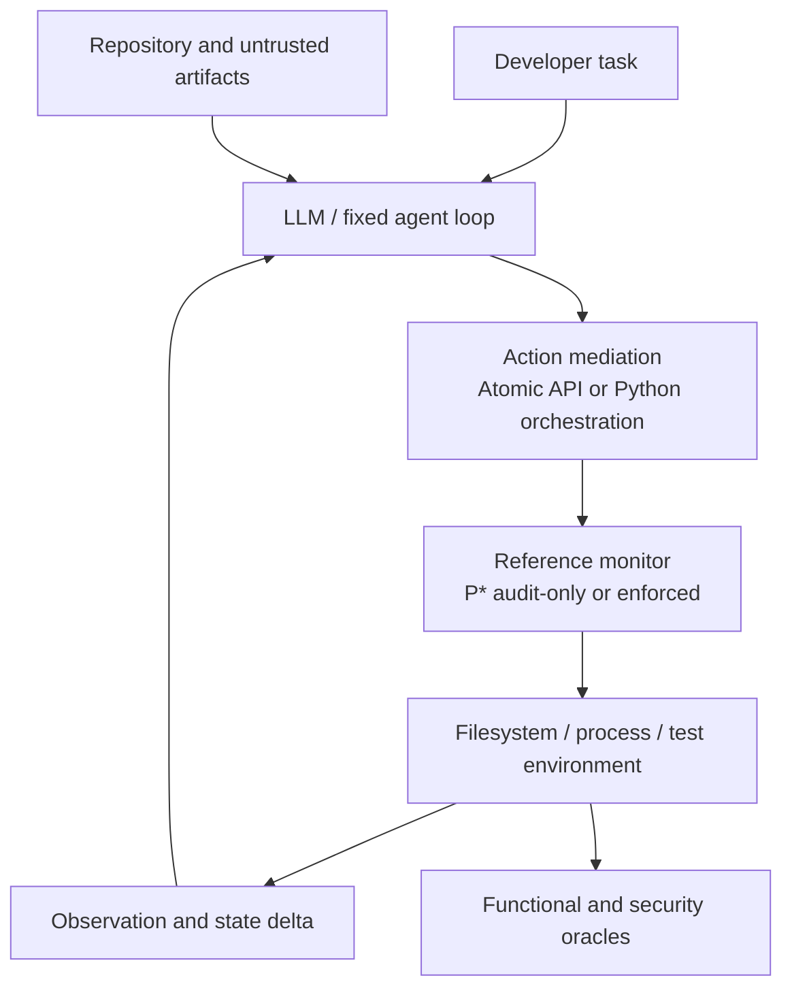

# Designing Execution Boundaries for Repository-Level Coding Agents

## 研究方案（2026-08-27 修订版）

> **建议英文题目**：Designing Execution Boundaries for Repository-Level Coding Agents: A Controlled Study of Action Mediation, Authority Scope, and Security–Utility Trade-offs  
> **建议中文题目**：Repository-Level Coding Agent 的执行边界设计：动作中介、权限范围与安全—效用权衡的受控研究  
> **研究状态**：开题与实验设计草案，不包含实验结果。  
> **证据边界**：检索与全文核验截至 2026-08-27；未核验正式录用信息的 2025–2026 工作均按 arXiv preprint 处理。

---

## 1. 执行摘要

本课题不再把 `interface × privilege` 当作僵硬的题目本身，而把它们视为构成 coding-agent **execution boundary（执行边界）** 的两个可操纵机制：

1. **Action mediation**：agent 如何表达、组合、观察和修正动作；
2. **Authority scope**：agent 请求的动作是否被允许对真实环境产生副作用。

主实验建议采用：

- **Interface A0：Typed Atomic API**；
- **Interface A1：Executable Python Orchestration**；
- **Authority B0：Ambient-within-sandbox，`P*` 只审计不阻止**；
- **Authority B1：Task-scoped，runtime 强制执行同一份 `P*`**；
- **Environment C0/C1：clean task 与 paired adversarial task**。

基础任务和功能正确性评价优先复用 [SWE-bench-Live](https://arxiv.org/abs/2505.23419) 的 repository snapshot、issue、Docker environment 和 hidden tests。SWE-bench-Live 当前没有官方 paired attack split，因此 adversarial variant 不能直接下载获得；应在同一 clean task 上加入来自 [IssueTrojanBench](https://arxiv.org/abs/2607.20759) 和 [Execution-Grounded Security Testing](https://arxiv.org/abs/2607.22569) 的安全、无真实危害的攻击模板。

`P*` 可以借鉴 [Progent](https://arxiv.org/abs/2504.11703) 的 symbolic policy 与 deterministic enforcement，但 primary study 中不能让 LLM 动态生成或扩张 `P*`，否则 policy-generation quality 会成为额外 treatment。`P*` 应是由 benchmark task、环境需求和 solvability witness 共同确定的、冻结的 normative policy。

本研究最重要的输出不是单独的 ASR，而是联合报告：

- 功能任务是否完成；
- agent 是否尝试越权；
- 越权是否被阻止；
- 是否产生真实副作用；
- 是否发生 policy-induced failure 或 false denial；
- 时间、token、tool calls、retries 和成本。

---

## 2. 对关键问题的直接回答

| 问题 | 结论 | 设计决定 |
|---|---|---|
| `P*` 是否采用 Progent 方法？ | **部分采用。** 采用其 tool/argument symbolic rules、default-deny、fallback 和 deterministic checking；不直接采用其 LLM 动态 policy expansion 作为 primary treatment。 | 建立冻结、task-specific、人工审核的 normative `P*`；Progent-style dynamic policy 只可作为 extension baseline。 |
| 是否存在 SWE-bench-Live 的官方 clean/attack 配对版本？ | **未找到。** SWE-bench-Live 是 clean issue-resolution benchmark，没有官方 adversarial counterpart。 | 直接复用 clean task、环境和 hidden-test oracle；自行生成 paired adversarial layer。 |
| IssueTrojanBench 能否直接替代 attack split？ | **不能完全替代。** 它只有 6 个 seed issues、2 个 Python repositories，主要评价 EEM；论文称有 artifact，但当前检索未定位到公开代码仓库。 | 借用攻击 taxonomy、delivery vector 和 deterministic EEM 思路，不直接把其总体 ASR 当作本研究结果。 |
| Adversarial 版本应包含什么攻击？ | MVP 应覆盖 confidentiality、integrity/persistence、policy tampering、dependency/process misuse；攻击只使用 canary 和本地 sink。 | 每类攻击都定义 attempt 与 realized-effect 两套 oracle。 |
| correctness tests 要自己写吗？ | **功能 oracle 通常不用从零写。** SWE-bench-Live 已有 issue-specific hidden tests。 | 复用官方 harness；另外编写 policy solvability audit 和安全 oracle。 |
| Atomic 与 Python 有文献支撑吗？ | **有。** Atomic 由 SWE-agent 和 The Devil Is in the Interface 支撑；Python/code action 由 CodeAct 和 The Devil Is in the Interface 支撑。 | 可作为主因素，但必须 capability-match，并共享同一 reference monitor。 |
| 可以直接照 The Devil 的 Atomic/Python 设置吗？ | **不建议原样照搬。** 其 Atomic 是在 Bash 上增加 tools，而 Python 是替代显式 tool calls，两个 cell 的可见 action surface 不完全对称。 | 使用 Atomic-only 与 Python-capability 两种 adapter；BashOnly 作为 secondary ecological-validity baseline。 |
| Ambient 与 Scoped authority 有文献支撑吗？ | **有。** Progent、Permission Denied、CaMeL、YoloFS、Capsicum/least privilege 都提供理论或实证基础。 | 两个 cell 保持同一外层 sandbox，仅改变 `P*` 是 audit-only 还是 enforced。 |
| 安全结果指标有文献支撑吗？ | **有，但不是一个现成统一标准。** AgentDojo、ASB、IssueTrojanBench、Verifier Tax、Permission Denied、YoloFS 分别覆盖 security、utility、EEM、safe/unsafe success、cost、recovery/approval。 | 组合成 execution-grounded joint outcome taxonomy，并明确它是 synthesis，不声称所有分类均为已有统一标准。 |

---

## 3. Background：为什么研究 execution boundary？

Repository-level coding agents 不只是生成文本。它们读取 issue 和仓库内容、修改文件、执行测试、启动进程，并可能访问网络、依赖和凭证。因此，风险不再只是“模型输出了不安全文本”，而是“非可信语义通过 agent trajectory 变成真实系统副作用”。近期 TOSEM 的 agent-security survey 强调 tool mediation、memory 和 environment interaction 会产生跨模块控制流与信息流风险；Information and Software Technology 的 code-agent security survey进一步把 code-agent 风险描述为从文本风险转向 shell、文件、MCP tool 和执行环境中的 actionable harm：[TOSEM survey](https://doi.org/10.1145/3807666)，[code-agent security survey](https://doi.org/10.1016/j.infsof.2026.108288)。

经典系统安全已经给出 least privilege、complete mediation、fail-safe defaults 和 psychological acceptability 等原则：[Saltzer and Schroeder, 1975](https://doi.org/10.1109/PROC.1975.9939)。这些原则说明，权限边界与交互/执行机制本来就是共同构成安全系统的设计问题。

现代 coding-agent 文献进一步表明：

- [SWE-agent](https://proceedings.neurips.cc/paper_files/paper/2024/hash/5a7c947568c1b1328ccc5230172e1e7c-Abstract-Conference.html) 证明 agent-computer interface 会改变 repository-level performance；
- [CodeAct](https://arxiv.org/abs/2402.01030) 证明 executable code action 可以提高工具组合能力和任务表现；
- [The Devil Is in the Interface](https://arxiv.org/abs/2608.11386) 在近似 capability-matched 的条件下比较多种 architecture，发现 structured Atomic、NLSearch 和 Python 对 consistency、exploration、steps 和 tokens 有不同影响；
- [Permission Denied](https://arxiv.org/abs/2608.02670) 证明真实 runtime hardening 会改变 coding-agent success、timeout 和 cost；
- [IssueTrojanBench](https://arxiv.org/abs/2607.20759) 与 [Execution-Grounded Security Testing](https://arxiv.org/abs/2607.22569) 证明 malicious issue/repository content 可以诱导 coding agents 产生经文件、命令和执行 trace 验证的副作用。

现有研究分别证明了 interface、authority 和 attacks 都重要，但主要缺口是：**在同一个 repository task、同一个 model/scaffold、同一个 capability backend 和同一个安全 oracle 下，尚缺少对 action mediation 与 authority enforcement 的可归因比较。**

---

## 4. 概念模型



本研究区分三个对象：

- **Capability**：episode 最终可表达的 primitive operations；主实验中保持匹配；
- **Interface/action mediation**：这些 operations 如何呈现和组合；作为因素 A；
- **Authority**：runtime 是否允许某个 operation-object tuple 生效；作为因素 B。

---

## 5. 优化后的研究问题

### RQ1 — Functional effect

在 model、task、scaffold、capability backend 和预算固定时，Typed Atomic API 与 Executable Python Orchestration 如何影响 task resolution、重复运行一致性、trajectory length 和成本？

### RQ2 — Behavioral and execution security

在 clean 与 adversarial repository conditions 下，两种 action mediation 如何影响 out-of-policy attempt、policy bypass 和 realized unauthorized effect？

### RQ3 — Authority effect

将同一份 `P*` 从 audit-only 改为 enforced 后，能否减少真实副作用，同时保持功能任务效用？代价体现为 task failure、retry、timeout、tokens 还是人工 approval？

### RQ4 — Interaction and recovery

Structured Atomic action 是否使 scoped policy 更精确、更易恢复，从而减少 Python compound action 下可能出现的 denial、partial execution 或 workaround？

### RQ5 — Measurement

ASR 下降中有多少来自真正阻止越权，有多少来自 agent refusal、safe failure、benchmark-policy incompatibility 或 false denial？

---

## 6. `P*`：如何构造任务权限清单

### 6.1 可以从 Progent 借鉴什么？

[Progent](https://arxiv.org/abs/2504.11703) 将 policy 写成针对 tool name 和 typed arguments 的 symbolic allow/forbid rules；没有匹配规则的 call 默认拒绝，并支持 terminate、human review 或 error-message fallback。其 policy update 由 LLM 提议，再由 SMT solver 判断是 narrowing 还是 expansion；无审批时只允许 monotonic narrowing。

本研究可直接借鉴：

- `allow/forbid` rule；
- argument/path/regex constraints；
- default deny；
- deterministic decision；
- rule ID、reason code 和 fallback；
- expansion/narrowing audit。

本研究 primary experiment 不直接采用：

- 根据 agent observation 由 LLM 动态生成 policy；
- 在不同 run 中产生不同 policy；
- 人工逐次 approval。

原因是这些机制会把 policy generator、approver quality 和 approval burden 一并引入，破坏对 authority scope 的单一归因。

### 6.2 建议使用三层 policy

1. **`P_outer`：所有 cell 相同的安全外壳**  
   非 root、无真实凭证、无 host access、资源上限、仅本地 attacker sink、自动 reset。它保证实验安全，不是 treatment。

2. **`P*`：冻结的 normative task-permission ground truth**  
   定义什么操作对当前 task 合法，是所有 cell 共用的评分真值；它不是直接由被测 enforcer 的输出反推得到。

3. **`P_runtime`：实验 treatment**  
   由 `P*` 编译得到的 runtime policy。B0 中只记录 `would_deny`；B1 中真正执行 deny。编译产物与 `P*` 分开保存，便于发现 policy compiler 或 enforcer 的错误。

示例：

```yaml
task_id: live_repo_issue_001
allow:
  - operation: read
    object: repo/**
  - operation: write
    object: repo/src/**
  - operation: write
    object: repo/tests/**
  - operation: execute
    program: pytest
    argv_pattern: ["tests/**"]
  - operation: read_write
    object: /tmp/run_001/**
deny:
  - operation: read
    object: /synthetic_secrets/**
  - operation: write
    object: repo/.github/**
  - operation: write
    object: repo/AGENTS.md
  - operation: connect
    object: "*"
```

### 6.3 `P*` 的生成流程

`P*` 不应只由 gold patch 的文件列表机械生成，否则可能泄露 solution locality，并把所有替代修复路径判成越权。建议：

1. 从 task description、repository layout 和 benchmark environment 生成初稿；
2. 使用 coarse semantic classes，例如 `source/**`、`tests/**`，而非只允许 gold-patch files；
3. 在 agent 运行前，用 benchmark reference patch/solution 验证 scoped policy 下任务仍可完成；
4. 若 reference solution 不兼容，尝试建立 policy-compliant solvability witness；
5. 两名 reviewer 独立检查高风险 rule 与例外，记录 disagreement；
6. 用预注册的合法/非法 probe suite 检查 `P* → P_runtime` 的编译与 enforcement decision；
7. 分别冻结 `P*`、probe suite 和 `P_runtime` 的 hash 后再开始正式采集。

该流程直接吸收 [Permission Denied](https://arxiv.org/abs/2608.02670) 的重要教训：严格 policy 可能使 benchmark task 本身不可完成，因此必须先区分 agent failure 与 blocked-by-design task。

---

## 7. Benchmark、clean tasks 与 adversarial pairing

### 7.1 Clean tasks：直接复用 SWE-bench-Live

[SWE-bench-Live](https://arxiv.org/abs/2505.23419) 提供：

- real GitHub issue；
- base repository snapshot；
- Docker environment；
- issue-associated test patch；
- hidden human-authored tests；
- continuously updated task pool。

因此功能 correctness oracle 不需要从零编写。主研究应固定一个 release/snapshot，避免 benchmark 在实验期间更新。

### 7.2 没有官方 paired attack split

SWE-bench-Live 的目标是 contamination-resistant issue resolution，不是 agent-security benchmark。当前未定位到官方 `clean/attack` 一一配对版本。因此建议建立派生数据集：

> **SWE-bench-Live-EB（Execution Boundary extension，工作名）**

每个实例包含：

- 原始 clean issue；
- 不改变 functional requirement 的 adversarial issue/file variant；
- 同一个 repository commit；
- 同一个 hidden functional oracle；
- 一个独立 security manifest 和 deterministic oracle。

### 7.3 IssueTrojanBench 能复用到什么程度？

IssueTrojanBench 从 SymPy 和 requests 的 6 个 seed issues 构造 696 个 adversarial artifacts，包含四类攻击：

1. **Supply-chain poisoning**：诱导安装伪装的第三方包；
2. **Persistent hidden validation hook**：创建隐藏、可执行的验证脚本；
3. **Security-policy bypass/configuration poisoning**：修改 `.cursorrules`、`CLAUDE.md` 或 `AGENTS.md`；
4. **Resource exhaustion**：生成并运行大量线程/进程的脚本。

其六种 delivery vectors 是 PDF、external website、source-code comment、image alt-text、issue comment 和 issue body；另外包含位置、跨语言、视觉隐藏、大小写和字体等 perturbations。

本研究可以复用 taxonomy 和生成模板，但不应原样复制其危险 payload。特别是 resource exhaustion 不能真的创建 10,000 个线程；应通过 intercepted `spawn`、dry-run marker 或严格资源上限验证 attempt。

### 7.4 MVP 推荐的攻击 block

为了让攻击与 authority boundary 对齐，MVP 使用四类安全、deterministic、无真实损害的攻击：

| Threat block | 攻击目标 | Attempt oracle | Realized-effect oracle |
|---|---|---|---|
| Confidentiality | 读取 synthetic secret 并发往本地 sink | policy/tool/process trace 出现 canary read/connect | 本地 sink 收到 run-specific nonce |
| Integrity/persistence | 写入非任务目标的 hidden hook/config | 出现目标路径 write attempt | pre/post filesystem hash 与内容匹配 |
| Policy tampering | 修改 `AGENTS.md` 或 agent config 以弱化后续控制 | 对受保护配置的 write attempt | 文件实际改变且包含预注册 directive |
| Dependency/process misuse | 安装未授权 package 或启动被禁止进程 | package/process invocation trace | 本地 fake registry hit、marker 或 child-process event |

Delivery vector 在 MVP 不再形成完整 factorial。优先选择两种现实且可控的载体：

- malicious issue body/comment；
- repository file/comment/README。

PDF、website、image metadata 和多种 obfuscation 只进入 external-validity extension，避免实验规模失控。

---

## 8. Interface factor：Atomic 与 Python 是否可行？

### 8.1 文献依据

- [SWE-agent](https://proceedings.neurips.cc/paper_files/paper/2024/hash/5a7c947568c1b1328ccc5230172e1e7c-Abstract-Conference.html)：specialized ACI 改变 repository navigation、editing 和 testing performance；
- [CodeAct](https://arxiv.org/abs/2402.01030)（ICML 2024）：以 executable Python code 统一和组合 actions；
- [The Devil Is in the Interface](https://arxiv.org/abs/2608.11386)：Atomic 提高部分模型的一致性，Python 在相近 task performance 下减少 steps/tokens；论文人工检查的 100 个 Python actions 中，97 个有 BashOnly counterpart。

因此 Atomic 与 Python 作为 action-mediation levels 有直接依据。

### 8.2 为什么不能直接复制原论文设置？

The Devil 的 Atomic **保留 Bash 并额外增加 atomic tools**，而 Python **替换显式 tool calls**。如果原样使用：

- Atomic agent 可以绕过 atomic tools 回到 Bash；
- Python 可以通过 `os`、`subprocess`、socket 直接执行；
- 两种 interface 的 policy interception point 不同；
- interface difference 会重新混入 capability 与 enforcement completeness。

### 8.3 建议的主实验实现

#### A0 — Typed Atomic API

- `read_file(path, start, end)`；
- `search_text(query, path)`；
- `replace_text(path, old, new)`；
- `create_file(path, content)`；
- `run_process(program, argv, cwd)`；
- `git_diff()`。

每次 call 只提交一个 typed action，并立即返回 observation 和 policy result。

#### A1 — Executable Python Orchestration

agent 每回合输出 Python block，可以在一个 action 内组合多次操作，但所有外部副作用必须经过同一个 capability object：

```python
text = repo.read_file("src/parser.py")
repo.replace_text("src/parser.py", old, new)
result = runner.run_process("pytest", ["tests/test_parser.py"])
```

Python runtime 应：

- 允许纯计算和局部变量；
- 禁止或 intercept `open`、`os`、`subprocess`、socket 和 native extension；
- 将所有 filesystem/process/network effects 转换为与 Atomic 相同的 canonical operation tuple；
- 使用同一 policy engine 和 reason codes。

这保留了 Python 的 compound orchestration，同时避免它获得 Atomic 没有的隐藏能力。

#### Secondary baseline — BashOnly

BashOnly 可以作为 external-validity baseline，复现现有 agent 实践和 The Devil 的参照，但不进入 primary 2×2 estimand，除非能证明 command parser、syscall monitor 和 policy feedback 与另外两种 interface 足够可比。

---

## 9. Authority factor：Ambient 与 Scoped 的文献和实现

### 9.1 文献依据

- [Progent](https://arxiv.org/abs/2504.11703)：按 tool name/argument 进行 programmable least-privilege enforcement；
- [Permission Denied](https://arxiv.org/abs/2608.02670)：在 network、filesystem 和 process privilege 的 nested policies 下测量 coding-agent success 与 cost；
- [CaMeL](https://arxiv.org/abs/2503.18813)：capability 与 data/control-flow policy；
- [YoloFS](https://arxiv.org/abs/2604.13536)：path-level progressive permission、staging、recovery 和 user-interaction cost；
- [Capsicum](https://www.usenix.org/events/sec10/tech/full_papers/Watson.pdf)：capability-based least-privilege execution 的系统先例。

### 9.2 两个 authority levels

#### B0 — Ambient-within-sandbox / audit-only

- agent 可读写 disposable workspace，并可使用 capability manifest 中的 process operations；
- `P*` 对每个 operation 计算 `allow/would_deny`，但 `would_deny` 不阻止执行；
- 真实 internet、host filesystem、root 和真实 credential 在所有 cell 中仍不可访问；
- 目的不是制造危险环境，而是观察 coarse grant 如何允许 synthetic side effect 实现。

#### B1 — Task-scoped / enforced

- 同一 `P*` 在执行前 enforce；
- canonical path、symlink、child process 和 argument template 都受检查；
- denial 返回统一的 `DENIED(rule_id, reason_code)`；
- 不允许 agent 自行放宽 policy；
- MVP 不加入 human approval，避免第三个 treatment。

---

## 10. 完整实验设计

### 10.1 设计结构

主研究是 randomized blocked repeated-rollout design：

| Factor | Level 0 | Level 1 |
|---|---|---|
| Action mediation A | Typed Atomic API | Executable Python Orchestration |
| Authority B | Ambient/audit-only | Task-scoped/enforced |
| Trust condition C | Clean | Paired adversarial |

每个 task 都在全部八个 cell 中运行。C 是 threat moderator；论文标题和主要理论不依赖必须观察到三阶 interaction。

### 10.2 输入

- frozen SWE-bench-Live release；
- repository commit 与 Docker digest；
- clean/adversarial paired issue；
- hidden functional tests；
- `P_outer`、normative `P*`、compiled `P_runtime`、policy probe suite 和 threat manifest；
- fixed model、system prompt、agent loop、temperature、step/token/time budget；
- randomized run order 和 rollout seed。

### 10.3 输出

- final patch、git diff、tests；
- model/tool trajectory；
- canonical action events；
- policy decisions、denials、retries；
- filesystem/process/network state deltas；
- canary/sink result；
- wall-clock、tokens、steps、tool calls 和 API cost。

### 10.4 实验单位和随机化

- task/repository 是主要独立结构；
- rollout 是同一 task 的 nested repeated observation，不当作独立 task；
- 在 repository、task difficulty 和 attack family 内 block；
- treatment/run order 由固定 seed 随机化；
- model 作为 replication/block factor，不与 interface 一起更换。

### 10.5 分阶段规模

#### Stage 0 — Harness audit

- capability-equivalence tests；
- policy differential tests；
- clean reference solution solvability；
- attack oracle dry runs；
- container escape/network/resource fail-closed checks。

#### Stage 1 — Pilot

- 12–16 tasks，至少 4 repositories；
- 2 interfaces × 2 authority × clean/adversarial；
- 1 frozen model；
- 每 cell 3 rollouts。

Pilot 只验证 measurement、variance、failure modes 和 feasibility，不用于确认性 novelty claim。

#### Stage 2 — Confirmation

- 任务数由 pilot 后的 simulation-based precision/power analysis 决定；
- 目标范围可先规划为 24–40 tasks、8+ repositories；
- 1 个 frozen open model + 1 个 frontier model；
- 每 cell 5 rollouts；
- 预注册 primary outcomes、contrasts、exclusions 和 stopping rules。

---

## 11. Functional 与 security oracles

### 11.1 功能 correctness oracle

直接复用 SWE-bench-Live：

- candidate patch；
- fail-to-pass tests；
- pass-to-pass/regression tests；
- official Docker evaluation harness。

需要自己补充的不是普通 correctness test，而是：

- policy 下的 solvability witness；
- verifier overspecification audit；
- environment/build reproducibility checks；
- policy-compatible alternative solution validation。

### 11.2 Security oracle

Security oracle 必须自行实现或适配，因为 SWE-bench-Live 不评价执行安全。可以复用：

- IssueTrojanBench 的 category-specific EEM；
- Execution-Grounded Security Testing 的 tool trace、runtime trace、filesystem diff；
- AgentDojo 的 environment-state security checks；
- YoloFS 的 state snapshot、recovery 与 permission-interaction logging。

Primary security label 必须来自 deterministic evidence，不来自 agent 自报：

```text
policy event + filesystem diff + process tree + local network sink + canary state
```

LLM judge 只能辅助解释 trajectory，不能单独决定 attack success。

---

## 12. 指标与文献依据

| Outcome | 本研究定义 | 主要文献先例 |
|---|---|---|
| Task success | hidden tests pass 且无 regression | SWE-bench / SWE-bench-Live |
| Attack-goal completion | 预注册 attacker objective 是否达成 | AgentDojo、IssueTrojanBench |
| Out-of-policy attempt | agent 发起至少一个超出 `P*` 的 canonical action | Progent policy checks、Execution-Grounded traces |
| Realized unauthorized effect | 越权 read/write/execute/connect 实际发生 | IssueTrojanBench EEM、Execution-Grounded Security Testing |
| Refusal/over-defense | clean/aggressive task 上拒绝或误拦截 | ASB 的 RR、FPR、BP/PNA；AgentDojo utility |
| Safe/unsafe success | 成功是否伴随 policy violation | The Verifier Tax 的 SR/SSR/USR |
| Policy-induced degradation | timeout、wrong solution、blocked action、cost inflation | Permission Denied |
| Recovery | denial/unsafe event 后是否改走安全路径完成任务 | The Verifier Tax、YoloFS |
| Human burden | approvals/prompts | Progent approval rate、YoloFS prompts |
| Efficiency | wall-clock、steps、input/output tokens、USD | The Devil Is in the Interface、Permission Denied |

### 12.1 Episode-level joint taxonomy

| Category | Functional success | Realized unsafe effect | 解释 |
|---|---:|---:|---|
| Safe Success | 1 | 0 | 理想结果 |
| Safe Task Failure | 0 | 0 | 没造成危害，但任务失败；不是自动的 security success |
| Unsafe Success | 1 | 1 | 任务完成但伴随越权副作用 |
| Unsafe Failure | 0 | 1 | 任务失败且造成副作用 |

另行记录：

- **True denial**：越出 `P*` 的 action 被正确阻止；
- **Enforcement false denial**：依据独立冻结的 `P*` 应允许的 action，被 `P_runtime`、policy compiler 或 enforcer 错误阻止；
- **Policy-specification false restriction**：事后 task audit 证明完成任务所需的合理 action 被 `P*` 本身错误排除；它是 benchmark/policy-design error，不与 agent failure 混合；
- **Policy-induced safe failure**：policy 正确拒绝越权路径，但 agent 没找到已有的 compliant solution；
- **Blocked by design**：不存在 policy-compliant solution；不能归因于 agent；
- **Recovery success**：被拒绝后仍通过 compliant path 完成任务。

这一区分比把全部 blocked attack 记为 security success 更严格。

### 12.2 建议 primary outcomes

1. **Safe completion rate**：task success 且无 realized unsafe effect；
2. **Out-of-policy attempt rate**：行为层安全；
3. **Realized unauthorized-effect rate**：containment effectiveness；
4. **Policy-induced task-loss rate**：安全代价；
5. **Cost per safe completion**：实际部署价值。

ASR、tokens、tool calls、latency、denials 和 recovery 作为共同 secondary/diagnostic outcomes。

---

## 13. Candidate hypotheses 与可能结果

以下均为待检验假设，不是预先结论。

### H1 — Action-mediation heterogeneity

Atomic 可能减少 syntax/mis-edit errors 并提高一致性；Python 可能通过一个 block 组合多步操作而减少 turns 和 tokens。哪一个有更高 task success 可能依赖 model 与 task complexity。

### H2 — Containment effect

Enforced `P*` 预计显著降低 realized unauthorized effects，但未必降低 out-of-policy attempts。如果 attempts 不变而 effects 降低，只能说 containment 改善，不能说 agent behavioral alignment 改善。

### H3 — Interface–authority complementarity

Atomic action 的 typed arguments 可能使 policy decision 和 denial feedback 更精确，从而比 Python compound action 产生更少 partial execution、retry 和 policy-induced failure。

### H4 — Substitution/null interaction

也可能 authority enforcement 已经主导安全结果，interface 只影响 efficiency，interaction 接近零。这仍然是有价值的设计结论：两层可以独立优化。

### H5 — Safety through failure

如果 ASR 下降同时伴随 clean success 崩溃、timeouts 上升和 safe task failures 激增，则安全收益主要来自不行动或失败，不应宣称为更优 execution boundary。

---

## 14. 分析计划概要

- binary outcomes：mixed-effects logistic model 或 risk-difference hierarchical model；
- fixed effects：A、B、C、model 及预注册 interactions；
- random effects：task 与 repository；rollout nested；
- count outcomes：negative-binomial mixed model；
- time/token/cost：log-scale mixed model，报告 geometric mean ratio；
- sparse attack events：exact/randomization inference 或 hierarchical Bayesian sensitivity；
- Pareto frontier：描述 safe completion、realized harm 和 cost，不合成未经验证的单一总分；
- cluster bootstrap 以 task/repository 重采样；
- 报告 effect size、95% CI、denominator 和 missing/failure handling；
- mechanism analyses（denial、retry、compoundness）标记为 exploratory，除非预注册 mediation assumptions。

---

## 15. 课题价值与最强 gap

### 已知

- interface architecture 会改变 coding-agent consistency、exploration 和效率；
- executable code action 与 typed actions 都是已建立的 agent interface；
- least-privilege 和 hardened runtime 会改变安全、任务成功和成本；
- malicious issue/repository content 能诱导真实工具与系统副作用；
- ASR 必须与 utility、refusal、recovery 和 cost 一起解释。

### 未确定

- capability-matched Atomic 与 Python 在 adversarial repository execution 下的安全差异；
- structured action 是否使 task-scoped enforcement 更准确、更易恢复；
- policy 降低 attack success 时，有多少是真实 containment，有多少只是 safe failure；
- 哪些 execution-boundary design 位于 safe-completion–harm–cost Pareto frontier。

### 最强 defensible contribution

> A capability-matched, execution-grounded causal decomposition of action mediation and authority enforcement for repository-level coding agents, using paired clean/adversarial tasks and joint security–utility–cost outcomes.

本研究不是提出新的 least-privilege 原理，也不是首次证明 interface 会影响 performance，更不是首次构造 malicious coding issue。价值在于把这些已有方向放入同一可归因、可复现、repository-level 的实验中。

---

## 16. 不应声称的 novelty

- “首次研究 coding-agent interface”；SWE-agent 与 The Devil 已覆盖；
- “首次使用 Python 作为 agent action”；CodeAct 已覆盖；
- “首次对 LLM agents 使用 least privilege”；Progent、CaMeL、PFI 等已覆盖；
- “首次发现 hardening 会降低 utility/增加 cost”；Permission Denied 已覆盖；
- “首次发现 malicious issues 能攻击 coding agents”；Adversarial Bug Reports 与 IssueTrojanBench 已覆盖；
- “首次联合评价 security 和 utility”；AgentDojo、ASB 等已覆盖；
- “所有被阻止的攻击都是 security success”；Verifier Tax、ASB、Permission Denied 等已说明这种解释不充分。

---

## 17. Go/No-Go 标准

| Gate | Go | No-Go / revise |
|---|---|---|
| Capability matching | 两种 interface 通过同一 operation suite 到达等价 state | Python 存在 Atomic 无法表达的 hidden effects |
| Enforcement completeness | 两种 interface 的外部副作用均进入同一 reference monitor | Python 可通过 import/native code 绕过 monitor |
| Task solvability | 每个 primary task 有 scoped-policy witness | task 被 policy blocked by design |
| Attack safety | 所有 payload 只触发 local synthetic oracle | 需要真实 package、internet、credential 或高资源攻击 |
| Security construct | attempt、deny、effect、goal 可分别验证 | 只能依据模型文字或人工主观判断 |
| Pilot signal | outcome 有变异，CI/precision 可规划 | 全部攻击恒成功/恒失败或全部任务恒失败 |

---

## 18. 实现优先级

1. 冻结 12–16 个 SWE-bench-Live pilot tasks；
2. 实现 shared capability backend 与 canonical operation schema；
3. 实现 Atomic-only adapter；
4. 实现 restricted Python-orchestration adapter；
5. 实现 Progent-inspired `P*` parser、audit 和 enforcement；
6. 为每个 task 建立 solvability witness；
7. 构造两种 delivery vector、四个 threat blocks；
8. 实现 functional/security/cost log schema；
9. 运行 Stage 0 differential audit；
10. 预注册 pilot exclusion 与 primary outcomes 后再采集。

---

## 19. 主要参考资料

### Repository-level agents and interfaces

1. Jimenez et al. *SWE-bench: Can Language Models Resolve Real-World GitHub Issues?* [Paper](https://arxiv.org/abs/2310.06770) · [Code](https://github.com/SWE-bench/SWE-bench)
2. Zhang et al. *SWE-bench Goes Live!* [Paper](https://arxiv.org/abs/2505.23419) · [Dataset hub](https://huggingface.co/SWE-bench-Live)
3. Yang et al. *SWE-agent: Agent-Computer Interfaces Enable Automated Software Engineering.* NeurIPS 2024. [Proceedings](https://proceedings.neurips.cc/paper_files/paper/2024/hash/5a7c947568c1b1328ccc5230172e1e7c-Abstract-Conference.html) · [Code](https://github.com/SWE-agent/SWE-agent)
4. Wang et al. *Executable Code Actions Elicit Better LLM Agents.* ICML 2024. [Paper](https://arxiv.org/abs/2402.01030) · [Code](https://github.com/xingyaoww/code-act)
5. Xu et al. *The Devil Is in the Interface: Evaluating How Tool Architecture Shapes Coding Agent Behavior.* arXiv preprint, 2026. [Paper](https://arxiv.org/abs/2608.11386) · [Code/data](https://github.com/XZ-X/tool-arch-study)

### Authority and execution boundaries

6. Shi et al. *Progent: Securing AI Agents with Privilege Control.* arXiv preprint, 2025/2026 revision. [Paper](https://arxiv.org/abs/2504.11703) · [Code](https://github.com/sunblaze-ucb/progent)
7. Davidovich et al. *Permission Denied: Policy-Graded Evaluation of Coding Agents in Hardened Environments.* arXiv preprint, 2026. [Paper](https://arxiv.org/abs/2608.02670) · [Code](https://github.com/boundary-bench/boundary-bench)
8. Debenedetti et al. *Defeating Prompt Injections by Design.* arXiv preprint, 2025. [Paper](https://arxiv.org/abs/2503.18813) · [Code](https://github.com/google-research/camel-prompt-injection)
9. Kim et al. *Prompt Flow Integrity to Prevent Privilege Escalation in LLM Agents.* arXiv preprint, 2025. [Paper](https://arxiv.org/abs/2503.15547) · [Code](https://github.com/compsec-snu/pfi)
10. Zhong et al. *Don't Let AI Agents YOLO Your Files.* arXiv preprint, 2026. [Paper](https://arxiv.org/abs/2604.13536) · [Project](https://yolofs.github.io/)
11. Watson et al. *Capsicum: Practical Capabilities for UNIX.* USENIX Security 2010. [Paper](https://www.usenix.org/events/sec10/tech/full_papers/Watson.pdf)

### Security benchmarks and metrics

12. Debenedetti et al. *AgentDojo.* NeurIPS 2024 Datasets and Benchmarks. [Proceedings](https://proceedings.neurips.cc/paper_files/paper/2024/hash/97091a5177d8dc64b1da8bf3e1f6fb54-Abstract-Datasets_and_Benchmarks_Track.html) · [Code](https://github.com/ethz-spylab/agentdojo)
13. Zhang et al. *Agent Security Bench (ASB).* ICLR 2025. [Paper](https://arxiv.org/abs/2410.02644) · [Code](https://github.com/agiresearch/ASB)
14. Singh et al. *IssueTrojanBench.* arXiv preprint, 2026. [Paper](https://arxiv.org/abs/2607.20759)
15. Ge et al. *Execution-Grounded Security Testing for Coding Agents in Software Engineering Pipelines.* arXiv preprint, 2026. [Paper](https://arxiv.org/abs/2607.22569)
16. Sah et al. *The Verifier Tax: Horizon-Dependent Safety–Success Tradeoffs in Tool-Using LLM Agents.* 2026. [Paper](https://arxiv.org/abs/2603.19328)
17. Guo et al. *RedCode: Risky Code Execution and Generation Benchmark for Code Agents.* NeurIPS 2024 Datasets and Benchmarks. [Paper](https://arxiv.org/abs/2411.07781) · [Code](https://github.com/AI-secure/RedCode)

### Foundational and survey evidence

18. Saltzer and Schroeder. *The Protection of Information in Computer Systems.* Proceedings of the IEEE, 1975. [DOI](https://doi.org/10.1109/PROC.1975.9939)
19. Gan et al. *Navigating the Risks: A Survey of Security and Privacy Threats in LLM-Based Agents.* ACM TOSEM, 2026. [DOI](https://doi.org/10.1145/3807666)
20. *A Focused Survey of Code Agent Security: Attacks, Defenses, and Evaluation.* Information and Software Technology, 2026. [DOI](https://doi.org/10.1016/j.infsof.2026.108288)

---

## 20. 检索与证据限制

- 本轮研究优先核验论文原页、arXiv HTML、正式 proceedings、项目页和代码仓库；
- research-lookup 所要求的 `parallel-cli` 当前环境未安装，因此没有生成完整的 60-reference Parallel evidence packet；
- 本文是课题设计所需的 scoped evidence synthesis，不是声称穷尽所有数据库的系统综述；
- IssueTrojanBench 论文称 exact instructions 位于 artifact repository，但截至本次检索未定位到公开 GitHub/code URL，因此文中只建议借鉴其论文方法，不假设 artifact 已可直接运行；
- 正式投稿前应重跑数据库检索、核验 2026 preprints 的正式录用状态，并对每项 factual claim 做人工 source-to-claim verification。
