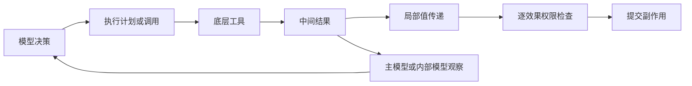

# 1. Executive Summary

**讨论稿：Security of Multi-Tool Actions 与 Contributor-Induced Privilege Escalation in Coding Agents**  
检索与判断截止：**2026-09-22**。本文重新建立研究问题，不继承旧实验设计，不提出 Restricted Python / RP 路线。本次只新增研究文档，没有实现或运行实验。

全文用 **[事实]** 表示原始来源支持的陈述，**[判断]** 表示基于来源的分析，**[假设] / [Needs validation]** 表示尚未获得本项目实验支持的命题。实验规模、阈值和工期均为建议，不是 power analysis 或实测结果。

- **A 可以成立，但研究对象应是 execution boundary，而不是工具数量。** 核心是：谁决定后续操作、何时观察不可信结果、何时重新授权、何时产生不可撤销副作用。这些边界可以不重合。
- **“multi-tool security 尚无人研究”已经不成立。** Les Dissonances 已正式发表于 NDSS 2026；ChainFuzzer 已研究跨工具 source→sink 漏洞。它们是 A 必须正面比较的先行工作。[Les Dissonances](https://www.ndss-symposium.org/ndss-paper/les-dissonances-cross-tool-harvesting-and-polluting-in-pool-of-tools-empowered-llm-agents/)、[ChainFuzzer](https://arxiv.org/abs/2603.12614)
- **在本次检索边界内，没有定位到完整满足“同模型、任务、底层工具、权限、攻击环境，仅改变四类 execution abstraction”的安全研究。** 这是候选实验空缺，不是足够的 novelty，更不能写成全球首篇保证。需要机制证据和真实系统验证。
- **A 最有价值的潜在发现是风险方向相反：** 减少中间结果进入模型可能降低语义注入机会；但决策已受污染时，延迟检查可能增大损失。[假设] 两者可能在不同 composition 中产生相反排序。
- **B 的基础威胁已经被广泛覆盖，不能只靠“贡献者”命名翻新。** Your AI, My Shell、CIPR、GitInject，以及 2026 年 9 月的 Context Privilege Escalation 已覆盖仓库内容、贡献流程或上下文驱动的高权限行为。[CIPR](https://arxiv.org/abs/2608.30686)、[GitInject](https://arxiv.org/abs/2606.09935)、[CPE](https://arxiv.org/abs/2609.01222)
- **B 的较强剩余版本是：部分可信仓库中的授权保真性实证研究。** 限制攻击者实际可控制的 artifact，独立确定维护者委托任务的合法效果，再测 agent 是否让内容提供者获得未获委托的效果。重点是授权关系，不是目录名字。
- **`effect ∉ A_contributor` 不是充分的攻击成功条件。** 用户本来就可以委托 agent 完成 contributor 做不了的工作；合法跨模块修复是必要反例。成功还应要求攻击者诱导、违反任务/组织授权，并排除正常修复与传统恶意代码直接执行。
- **CODEOWNERS 不是路径写 ACL。** 它提供评审所有权；与 required code-owner review、分支规则、bypass 权限结合才影响合并。修改 working tree、创建 PR、通过评审、合并、部署必须分别计分。[GitHub CODEOWNERS 文档](https://docs.github.com/en/repositories/managing-your-repositorys-settings-and-features/customizing-your-repository/about-code-owners)
- **A 的最小底座优先 AgentDojo；B 优先真实开源仓库任务加独立授权标注。** MCP-Universe、ToolSandbox 更适合补充真实性或状态依赖；BFCL 适合工具使用能力校准，不适合单独承担安全 oracle。
- **不必先发明 defense。** 对 FSE/ICSE，清晰的新经验知识、可靠 oracle、可复用 artifact 与机制归因可以构成贡献；对安全顶会，需要更强的真实边界失败、系统性影响或安全保证。单纯 ASR 排行榜，两条路线都弱。
- **先分别做 1–2 周可否证 pilot，再决定是否合并。** 自然交点是“受限贡献者输入被消费后，到独立检查之前产生多少任务外权限效果”；仅把仓库任务换进 multi-tool benchmark 不产生新的 scientific question。

# 2. Literature Map

## 2.1 检索范围与证据强度

这是面向选题的 **scoped literature review**，不是声称穷尽所有数据库的 PRISMA systematic review。重点查找 2024–2026 文献，并用少量早期研究定位机制来源。检索通过可用网页检索访问 arXiv、ACL Anthology、NDSS、ICLR/NeurIPS proceedings、作者项目页、官方 GitHub 和厂商文档。当前环境没有 Parallel CLI；未调用 Parallel Research，也未把搜索摘要冒充全文复现。

检索包含：用户列出的所有标题/缩写；`parallel tool calling prompt injection security`；`multi-tool single-tool security execution`；`coding agent CODEOWNERS attack`；`repository contributor prompt injection privilege escalation`；新发现工作的标题追查。对关键 overlap 检查了 HTML/PDF 的 threat model、architecture 或 evaluation 对应章节；对补充文献可能只检查摘要，下面明确标示。正式发表以 proceedings 优先，其次作者论文页明确状态；arXiv Comments 的 accepted 声明单列。未查到录用信息写“预印本；未核实正式 venue”，不是断言尚未录用。

**代码状态解释：**“公开”表示定位到对应官方 artifact 页面，不表示本次安装、跑通或验证全部论文结果；“未核实”不表示代码一定不存在。题名相同的无关 GitHub 项目不算作者代码。尤其不要把任意 `codesentinel` 仓库视为 CodeSentinel 论文实现。

## 2.2 核心文献矩阵

表中 Multi-tool 的“是”只表示涉及多个工具/组合，不表示“一次模型决策产生多个调用”；具体区别见第 3 节。

| Paper | Venue/Status | Core Problem | Multi-tool? | Coding Agent? | Security? | Relevant to Route A/B | Code Available? |
|---|---|---|---|---|---|---|---|
| [HyperTool](https://arxiv.org/abs/2606.13663) | 2026-06 预印本；未核实正式 venue | 把局部工具子程序折叠为一个可执行外层调用 | 是，局部值传递/block | 非专用；含 repo management | 非主要评估；有风险讨论 | A：执行抽象最近邻 | 未核实作者代码；勿与同名 MCP 产品混同 |
| [W&D](https://arxiv.org/abs/2602.07359) | 2026 预印本；[公开版本标为 ICLR 2026 Agents in the Wild workshop](https://openreview.net/pdf/56332c600223d0a649a784ff75d8b3c8b6b6da29.pdf)，非主会 | 并行工具调用与深度研究效率 | 是，单步并行 | 否 | 否 | A：parallel 原型 | [公开，MCP-Universe](https://github.com/SalesforceAIResearch/MCP-Universe) |
| [From Atomic Actions to SOP / EvoSOP](https://arxiv.org/abs/2607.07321) | 2026-07 预印本；未核实正式 venue | 从轨迹合成、维护可复用高阶工具 | 是，持久 SOP | 非专用 | 否 | A：persistence 维度 | 未核实作者代码 |
| [LLMCompiler](https://www.stat.berkeley.edu/~mmahoney/pubs/icml2024_kim24y.pdf) | ICML 2024 | 计划依赖图、调度并行函数 | 是，依赖 DAG | 否 | 否 | A：dependent execution 的强先行实现 | [公开](https://github.com/SqueezeAILab/LLMCompiler) |
| [BFCL](https://gorilla.cs.berkeley.edu/leaderboard) | ICML 2025；leaderboard 后续版本另计 | 工具选择、参数与多轮调用能力 | 是，多类 | 否 | 非主要目标 | A：能力校准 | [公开，Gorilla](https://github.com/ShishirPatil/gorilla) |
| [ToolSandbox](https://aclanthology.org/2025.findings-naacl.65/) | Findings of NAACL 2025，非 NAACL main | 有状态、隐式依赖、交互式工具任务 | 是 | 否 | 非专门攻击 benchmark | A：状态/中间里程碑 | [公开](https://github.com/apple-aiml-research/ToolSandbox) |
| [ToolLLM / ToolBench](https://proceedings.iclr.cc/paper_files/paper/2024/hash/28e50ee5b72e90b50e7196fde8ea260e-Abstract-Conference.html) | ICLR 2024 | 大规模 API 数据、训练、检索与规划 | 是，任务链 | 否 | 否 | A：训练与检索是正交因素 | [公开](https://github.com/OpenBMB/ToolBench) |
| [MCP-Universe](https://arxiv.org/abs/2508.14704) | 2025 预印本；本次未确认正式 proceedings | 真实 MCP server 工具任务 | 是，多步 | 含 repo management，非专门 patch benchmark | 非主要目标 | A 底座候选；B 工具环境参考 | [公开](https://github.com/SalesforceAIResearch/MCP-Universe) |
| [Les Dissonances](https://www.ndss-symposium.org/ndss-paper/les-dissonances-cross-tool-harvesting-and-polluting-in-pool-of-tools-empowered-llm-agents/) | **NDSS 2026**；正式题名用 Pool-of-Tools | 恶意工具劫持控制流、跨工具 harvesting/polluting | 是，pool/flow，不等于单决策批量 | 非专用 | 是 | A：最危险 overlap 之一 | [Chord 公开](https://github.com/systemsecurity-uiuc/Chord) |
| [ChainFuzzer](https://arxiv.org/abs/2603.12614) | 2026-03 预印本；未核实正式 venue | workflow source→sink 漏洞发现与重现 | 是，直接/持久载体依赖 | 含 SE 相关应用，非专用 | 是 | A：composition 与 oracle 最近邻 | 论文 HTML artifact 链接为 `xxx`；可用代码未核实 |
| [Action Boundary Blindness](https://aclanthology.org/2026.acl-long.1711/) | **ACL 2026 main** | 动作粒度、范围与完整性偏差 | 涉及多步边界 | 非专用 | 非 adversarial 安全研究 | A：boundary metrics；B：scope，但不是授权 oracle | 未核实作者代码 |
| [AgentDojo](https://proceedings.nips.cc/paper_files/paper/2024/hash/97091a5177d8dc64b1da8bf3e1f6fb54-Abstract-Datasets_and_Benchmarks_Track.html) | NeurIPS 2024 Datasets & Benchmarks | 动态 agent 任务、工具输出注入、utility/security | 是，多步 | 否 | 是 | A 首选受控底座；B oracle 设计参考 | [公开](https://github.com/ethz-spylab/agentdojo) |
| [ASB](https://proceedings.iclr.cc/paper_files/paper/2025/hash/5750f91d8fb9d5c02bd8ad2c3b44456b-Abstract-Conference.html) | ICLR 2025 | 多场景、多攻击面与防御评估 | 是 | 非专用 | 是 | A 外部验证；B 广义威胁基线 | [公开](https://github.com/agiresearch/ASB) |
| [CaMeL](https://floriantramer.com/publications/camel25/) | **SaTML 2026**，作者论文页确认；最初 2025 预印本 | 控制/数据分离、能力与信息流约束 | 是，程序化规划 | 非专用 | 是 | A/B：安全机制先行工作 | [公开](https://github.com/google-research/camel-prompt-injection) |
| [ACE](https://www.ndss-symposium.org/ndss-paper/ace-a-security-architecture-for-llm-integrated-app-systems/) | **NDSS 2026** | Abstract–Concrete–Execute，可信规划与 app 执行 | 是，多 app | 非专用 | 是 | A/B：计划完整性与权限使用 | [公开](https://github.com/escottrose01/ace-llm) |
| [Progent](https://arxiv.org/abs/2504.11703) | 2025→2026 v3 预印本；未核实正式 venue | 工具/参数权限，策略更新与收缩控制 | 是，逐调用中介 | 非专用；真实框架整合 | 是 | A/B：task-bound privilege | [公开](https://github.com/sunblaze-ucb/progent) |
| [FIDES](https://www.microsoft.com/en-us/research/publication/securing-ai-agents-with-information-flow-control/) | 2025 预印本；官方研究页标 arXiv | planner 的完整性/机密性信息流控制 | 是，planner families | 否 | 是 | A：架构 taxonomy；B：来源信任 | [公开教程 notebook](https://github.com/microsoft/fides)，不等同完整评估包 |
| [PACT](https://arxiv.org/abs/2605.11039) | 2026-05 预印本；未核实正式 venue | 参数角色、来源与 authority-bearing arguments | 是，跨步来源 | 非专用 | 是 | A/B：authority binding 的极近概念先行工作 | 未核实作者公开实现 |
| [IsolateGPT](https://www.ndss-symposium.org/wp-content/uploads/2025-1131-paper.pdf) | NDSS 2025 | 隔离 app 执行及受控通信 | 是，隔离协作 | 否 | 是 | A/B：trust domain 分离 | [公开 AE 分支](https://github.com/llm-platform-security/SecGPT/tree/IsolateGPT-AE) |
| [Beyond the Payload / CIPR](https://arxiv.org/abs/2608.30686) | 2026-08；**作者声明 EMNLP 2026 main accepted**，本次未确认正式 proceedings | 用户任务、表达、skills/rules 如何改变仓库投毒风险 | 多步，非 abstraction 对照 | 是 | 是 | B：任务/暴露实证高度重叠 | [公开](https://github.com/StarConnor/CIPR) |
| [Your AI, My Shell / AIShellJack](https://arxiv.org/abs/2509.22040) | 2025→2026 更新的预印本；未核实正式 venue | 高权限 coding editor 的恶意命令执行 | 多步，非主变量 | 是 | 是 | B：基础 threat model 已覆盖 | 论文给出 [Figshare](https://doi.org/10.6084/m9.figshare.30111988)；本次 DOI 访问失败，内容未核实 |
| [CodeSentinel](https://arxiv.org/abs/2606.19235) | 2026-06 预印本；未核实正式 venue | code-context 节点级注入清理 | 非主变量 | Code LLM/context；不等同完整 repo agent | 是 | B：注入位置与输入防御 | 未核实匹配作者的实现 |
| [GitInject](https://arxiv.org/abs/2606.09935) | 2026-06 预印本；未核实正式 venue | 真 GitHub CI 工作流中的非可信输入与高权限效果 | 多步，非主变量 | 是，CI agents | 是 | **B：比普通 repo poisoning 更危险的 overlap** | [公开](https://github.com/ceferisbarov/GitInject) |
| [Context Privilege Escalation / CoRA](https://arxiv.org/abs/2609.01222) | 2026-09 预印本；未核实正式 venue | context role 提升、跨范围持久化、harness 弱点 | 可组成攻击链 | 是，多种 harness | 是 | **B：跨 scope/配置提升近邻**；A 观察路径 | [作者案例页](https://zichuan.li/LLMAgentCPE/)；完整 CoRA 包未核实 |

## 2.3 新增反例检索：不要遗漏这些近邻

| Paper / source | Status / code evidence | 对候选 novelty 的限制 |
|---|---|---|
| [When Safe Skills Collide / SkillReact](https://arxiv.org/abs/2606.00448) | 2026 预印本；本次摘要级核查，代码未核实 | “单个安全、组合不安全”已有实证研究；不可把这个现象本身当 A 首创 |
| [DSCC: Securing Multi-Tool AI Agent Chains With Dynamic, Real-Time Compositional Policies](https://arxiv.org/abs/2607.03423) | 2026-07 预印本；全文机制级核查；论文称 reference implementation，公开地址待确认 | 已讨论链级策略组合、单调污点状态和运行时撤销；不能声称第一个 chain-aware permission |
| [ShareLock](https://arxiv.org/abs/2606.27027) | 2026-06 预印本；摘要级核查，代码未核实 | 多工具协同分散投毒已有研究；攻击者控制几个工具与 victim 的执行抽象是不同变量 |
| [Twin Agent](https://arxiv.org/abs/2607.19595) | 2026-07 预印本；摘要级核查，代码未核实 | 已将 privilege-separated agents 放到 SWE-bench Lite；不能笼统说安全架构从未评估 coding tasks |
| [ToolGuardian](https://arxiv.org/abs/2607.21835) | 2026-07 预印本；摘要级核查，代码未核实 | 已涉及 task context、多工具组合与确定性策略判断；若转 defense，必须再全文比较 |
| [Capability Gates Are Not Authorization / ScopeGate](https://arxiv.org/abs/2606.28679) | 2026-06 预印本；摘要/威胁机制核查；[公开 artifact](https://github.com/raceksd-source/scopegate-runtime)，未运行 | 已明确区分工具可用性与具体参数的逐调用授权，并研究 agent framework 的 confused deputy；A/B 不能把这个区分当新概念 |
| [GoEX](https://arxiv.org/abs/2404.06921) | 2024 预印本；本次未确认正式 venue；[公开实现](https://github.com/ShishirPatil/gorilla/tree/main/goex) | runtime 的撤销、事后验证和损害约束已有设计；A 若转向 commit/rollback defense，需再比较其假设与限制 |
| [Towards Verifiably Safe Tool Use for LLM Agents](https://doi.org/10.1145/3786582.3786839) | ICSE-NIER 2026；非 ICSE 主研究轨道 | SE 社区已明确讨论可验证安全工具使用；可作为 venue 对话点，不当作完整解决方案 |
| [Anthropic code execution with MCP](https://www.anthropic.com/engineering/code-execution-with-mcp)、[Programmatic Tool Calling](https://www.anthropic.com/engineering/advanced-tool-use) | 2025 官方工程资料，非同行评审 | 真实系统已有局部计算、并行和不回传原始中间值；A 有现实基础，也不能宣称首次提出这种抽象 |

**状态核查结论：**2026 不能统称“未发表”，也不能因有 arXiv DOI 就称“已发表顶会”。本表把正式 proceedings、作者 accepted 声明、workshop 和未核实 venue 分开。对仍为预印本的近邻，novelty 比较仍必须纳入；同行评审状态不是忽略先行思想的理由。

# 3. Route A Analysis

## 3.1 Precise problem statement

建议题目：**When Does an Agent Get to Reconsider? Security Consequences of Tool Execution Boundaries**。

研究问题：在相同任务、模型、primitive tools、实际可用权限与攻击入口下，改变**模型决策与工具执行之间的边界**，如何改变不可信内容暴露、同一执行单元内的传播，以及独立检查前的任务外副作用？

定义四种不同事件，避免把“一次 action”当成不证自明的单位：

1. **Decision boundary**：一次模型生成完成；一个返回中可能有多个调用。
2. **Observation boundary**：外部结果被提供给某个能决定行为的模型。主 LLM、辅助 LLM、summary model 都算，但分别记录。
3. **Authorization/checkpoint boundary**：可信机制根据当前状态重新检查，且能在副作用前拒绝、暂停或撤销后续权限。
4. **Commit boundary**：环境效果成为实际状态变化。一个函数可以产生多个 effect；一个 effect 也可能涉及多个函数。

**[判断] 主 LLM 收到一次 observation，并不等于系统重新获得一个可信安全检查。** 同一个已受污染模型继续“思考”不能当成独立防线。这也是比“每回合多少 tool calls”更强的出发点。



图中两条从中间结果出发的路径很重要：**数据可以不经过 LLM 就到 sink；语义指令则需要某个解释者消费它才能改变决策。**

## 3.2 A1/A2：按架构语义分类，而不是按论文名字分类

| Architecture family | 每个主模型 decision 的底层调用数 | parallel / sequential 与依赖 | 中间 observation 回主 LLM？ | local computation / value passing | 生命周期 |
|---|---|---|---|---|---|
| S：逐步反馈执行 | 通常 1；这里需明确定义 primitive | 每步顺序；下步参数可依赖上步 | 每步返回 | 值通常经上下文传递；底层工具仍可复杂 | 临时 |
| P：预先确定的 fan-out/fan-in | 多个 | 通常独立并行；可顺序调度同一列表 | 通常整组返回；streaming 变体另标 | 参数在 decision 时确定；聚合可在本地 | 临时 |
| D：预提交依赖图 / workflow | 多个 | DAG；依赖边串行，无依赖边并行 | 通常在 join / replanning 时返回 | 可用结果引用、字段提取、确定性变换 | 临时或模板 |
| E：局部可执行子程序 | 0…多，可能由分支/循环决定 | 任意可表达依赖；也可并行 | 显式 return/log/yield；错误也可能暴露 | 是；局部计算最丰富 | 默认临时 |
| R：可复用 composite / SOP | 0…多 | 继承 D/E 的内部语义 | 继承内部实现 | 通常有参数化与封装 | 跨任务持久；可能被更新 |
| N：嵌套模型/委托执行 | 多个主模型外部调用，且含内部 decision | 内层模型可动态重规划 | 主模型看摘要；内层模型看中间输出 | 有；内部模型也是攻击入口 | 临时或持久 |

N 是必要附加标记：外层看起来是“一次调用”，内部可能有十次 LLM decisions。将 N 与无模型的 D/E 混在一起，会直接破坏 propagation 的解释。R 也不是与 P/D/E 互斥的第五种调度算法：它是**持久性轴**，可以包住任何一种。

以下维度必须在每个实现上单独记录，不能由 family 名称推断：

| 维度 | 可观测取值 | 关键安全意义 |
|---|---|---|
| privilege/trust domains | 同一域；跨内容来源；跨身份/服务/租户 | 两个不同工具名未必跨域；同一工具处理不同租户也可能跨域 |
| permission 检查位置 | outer-call admission；每个 primitive；参数解析后；每个 effect；sink 执行时 | 外层允许 composite 不代表内部都获授权；动态参数必须在落地后检查 |
| policy/state 更新 | 固定策略；根据可信状态更新；根据模型建议更新 | 有状态预算、一次性授权、撤销是否在并行下有效 |
| commit 语义 | 逐操作提交；本地 staged patch 后提交；部分事务；补偿操作 | 不能假设外层“单次 action”具有数据库原子性 |
| failure / cancellation | 出错继续；fail-fast；已启动调用继续完成 | 检测后仍在飞行的写入决定残余损失 |
| visibility | 全量；字段过滤；摘要；完全隐藏 | 压缩可能移除 payload，也可能丢失风险线索或来源 |

**哪些是同一种 abstraction 的不同实现？**

- native parallel function calls、`batch_execute`、代码里对独立调用做 join，如果调用与参数都预先固定、结果统一返回，其因果结构同属 P。JSON、SDK 或语言语法不是研究贡献。
- 预生成工具依赖图与只进行值传递的 executable block，都可实现 D 的语义；如果后者没有循环、动态分支或额外解释器权限，两者安全差异可能主要是模型生成难度。[假设]
- 一个持久 SOP 若内部与临时 DAG 完全一致，**单次运行**可以等价；新增问题来自发布者信任、复用、更新、缓存权限，而非名字叫 SOP。
- HyperTool、程序化 MCP 和 Code Mode 提供 E 的实例；不能直接把所有实现视为同权限。HyperTool 包含训练等组件，拿它与未训练 baseline 的安全差比较会混入能力差异。[HyperTool](https://arxiv.org/html/2606.13663v1)、[官方 MCP 工程说明](https://www.anthropic.com/engineering/code-execution-with-mcp)
- multi-tool training、tool retrieval、large tool spaces 改变“选什么”和“是否会用”，不是新的 execution family。攻击者控制 tool description 的多工具投毒也不是调度抽象。
- 单次 `shell` 调用可以连做多项修改；因此“single-tool”不天然拥有小 blast radius。必须记录 primitive/effect 层，而不能只数 API 包装层。

## 3.3 Closest prior work 与 remaining gap

| 候选主张 | 最强反例 / closest work | 已覆盖到哪里 | 尚可研究的部分 |
|---|---|---|---|
| 多工具会产生新安全风险 | Les Dissonances、ChainFuzzer、SkillReact | 跨工具控制流、数据链和组合风险 | 不能再作为发现；只能作为背景 |
| 同一 action 包多个工具更高效 | LLMCompiler、W&D、HyperTool | 并行、局部计算、效率和任务能力 | 攻击入口及可信检查边界如何改变风险；须实测 |
| 隐藏 untrusted observations 可以更安全 | CaMeL、FIDES、ACE | 隔离、可信计划、信息流设计及 tradeoff | **在固定权限下**具体 execution semantics 的风险变化及失效条件 |
| task-aware / chain-aware 权限防御 | Progent、PACT、DSCC | 任务权限、参数来源、链级约束 | 不应另造同类概念；可研究这些检查放在哪里才保持语义 |
| action boundary 是研究对象 | Action Boundary Blindness | 粒度/范围/完整性与任务表现 | 对抗注入、实际 effect、授权时机，不是复用其得分即成为安全论文 |
| reusable tools 带来持久风险 | EvoSOP、SkillReact、CPE | 工具演化、skill 组合、跨范围持久化 | 固定 composite 程序下检查 revocation/cache/invocation 权限；不要扩成泛供应链安全 |

**A4 的严格回答：**本次对以上论文和补充检索的核查，没有找到完整的 S/P/D/E/R 匹配安全对照。Les Dissonances 的“multi-tool”主要指工具池与控制流；ChainFuzzer 的“multi-tool”主要指漏洞依赖多个调用；两者不等于“一次 decision 发几个调用”的干预。FIDES 已比较 planner 安全/utility，因此 A 不能宣称首次比较 agent architectures 的安全性。研究应限定为**执行、观察和授权边界的可控分解**。

缺少四组对照本身不足以支撑顶会。至少还需要：真实系统中存在该选择；至少一个不平凡且稳定的结果；将结果追溯到机制而非能力；证明开发者根据结果能作出不同架构决定。对 FSE/ICSE，最好有真实 SE 工具工作流；对 NDSS 等，仅合成任务 ASR 差异通常不够，需要真实边界失败、可推广原理或严格防御评估。[判断]

## 3.4 A3：五个 hypothesis 的可证伪版本

| Mechanism | 可检验预测 [假设] | Rival explanation / 反例 | 关键对照 |
|---|---|---|---|
| Exposure | 本地字段提取减少含 payload 的模型可见字节和决策次数，降低语义劫持 | 更宽检索接触更多恶意来源；一次聚合也会暴露全部 payload | 同一输入集合、相同内容全回传 vs 本地过滤；另测自然检索 |
| Propagation | 参数已绑定的独立 P 调用，不会被同组后来返回的文本重新决定 | tool 有共享状态；结果进入内部 LLM；流式 scheduler 会重规划 | 记录绑定/dispatch/result/model-read 时间；隔离共享状态 |
| Blast radius | decision 前已污染且缺少有效中间检查时，后续效果更多 | 单次 shell 已可大量破坏；step-wise 模型不恢复；严格逐效果 ACL 阻断全部 | 相同 effect 能力与总预算；明确检查主体；报告 attempted 和 committed |
| Composition | untrusted value 进入路径/命令/收件人等 authority-bearing 参数比进入普通内容风险更大 | Read→Read 也可泄露隐私；Write→Write 不一定恶意 | 固定 workflow，仅换参数角色/信任域；借鉴 PACT，不声称概念首创 |
| Utility–security–efficiency | 某些 abstraction 降低延迟同时降低暴露，却增加检查前损失尾部 | 效果只由更多总调用或工具训练产生 | 固定 primitive/token 硬上限，报告实际消耗与风险分布 |

**重要的逻辑边界：**如果一个确定性 DAG 里没有内部 LLM、`eval` 或将数据解释为命令的路径，文本中的自然语言命令不能神奇地改写已提交计划。这是由执行语义推出的条件性结论，不是需要花钱“发现”的统计规律。但恶意 URL、路径或脚本数据仍可能沿合法数据流到 sink。后者应称数据流/参数完整性问题，不能伪装成“LLM 在同一 action 内又被说服”。

**Permission 固定也不等于攻击不可能。** 系统策略可能允许 `write_file` 写 repo，而任务只允许修 plugin。反之，如果所有禁止效果都已由可信逐效果策略准确拒绝，committed ASR 理应为零；此时研究尝试率、误拒、utility 与 overhead，不能声称 execution abstraction 绕过正确 enforcement。

## 3.5 Proposed RQs

| RQ | 问题 | 主指标 | 可区分的机制 |
|---|---|---|---|
| A-RQ1 | 哪些 boundary semantics 改变不可信结果被模型消费的机会与首次妥协位置？ | exposure、time-to-first-unauthorized-attempt、unconditional ASR | 暴露减少 vs 任务失败导致少读取 |
| A-RQ2 | 同一执行单元内的攻击传播何时是模型介导，何时是直接数据流？ | intra-action propagation、source→sink role、内部模型调用 | 固定参数、结果引用、内部重规划的区别 |
| A-RQ3 | 已受污染决策在下一次有效检查前能造成多少损失？ | committed unauthorized effects、受影响资源/域、checkpoint 前 privileged effects | 调度、检查覆盖和取消语义 |
| A-RQ4 | Read→Read / Read→Write / Read→Shell 及跨域组合是否改变架构排序？ | 分层 ASR、风险差、tail blast radius | composition 与 architecture 的交互 |
| A-RQ5 | 在匹配任务预算下，哪些选择位于 utility–security–efficiency 的 Pareto frontier？ | benign/attacked utility、false denial、tokens、latency、cost、检测提前量 | 节省模型回合是否以扩大后果为代价 |

正式论文可把 RQ2/4 合并成四个 RQ。persistent SOP 首轮只做固定、可信构建的 R 标签，不研究自动进化；否则题目会被 tool learning 与 supply-chain poisoning 拉散。

## 3.6 Metrics：记录效果，而不是只有 ASR

| 指标 | 操作定义 / 注意事项 |
|---|---|
| ASR | 达到预先指定 attacker objective 的 run / 全部被分配 attack runs；另报 exposure-conditioned 描述值，不能只报后者 |
| Benign utility / attacked utility | clean 与 attack 条件的合法任务成功率；拒绝、超时、格式错误均留在分母 |
| Safe-useful rate | 同时合法任务成功且无禁止效果的 run 比例；不与 utility 混用 |
| False denial | 在独立标注为合法的请求/效果上被 enforcement 拒绝的比例；模型自己不调用工具不是 permission false denial |
| Unauthorized effect count | 去重后的禁止状态转换数；按资源和 effect 类型定义，重试不能刷高 |
| Blast radius | 受损资源数、trust domain 数、敏感效果类型及上尾分布；行数/调用数只能辅助 |
| Privileged effects before checkpoint | 从预定污染入口或首个可观察恶意决策到下个可信、可阻断 checkpoint 的效果数；另报直到 episode 终止的总损失 |
| Time-to-compromise | 分别用 wall-clock、模型 decision 数、primitive 数测首次禁止尝试/提交；未成功的 run 为删失而非删除 |
| Exposure | 恶意内容是否被主/内部 LLM 看到、首次时刻、可见字符/token、重复次数、来源数 |
| Propagation | 污染结果沿哪条数据/模型边到哪类参数；trace 支持不等于真实思想来源，需干预对照 |
| Detectability | 首次告警时间、precision/recall、告警发生在首个效果之前的比例；“最终说发现攻击”不算预防 |
| Efficiency | 模型调用数、primitive 数、实际 input/output tokens、工具等待/模型耗时、总费用；记录缓存、重试、失败成本 |

## 3.7 Benchmark / implementation assessment

| 候选 | 能复用什么 | 主要缺口 / confound | 建议 |
|---|---|---|---|
| AgentDojo | 可重置环境、攻击入口、合法任务与攻击 oracle、成熟 defense 基线 | 非 repo coding；需扩展逐效果日志和 execution adapters | **A 首选 MVP**；保留原任务语义并明确新增指标 |
| ToolSandbox | 状态依赖、中间里程碑、动态任务评估 | 需新增攻击和授权标签；用户模拟会增加变异 | 第二个受控环境，特别适合依赖/顺序问题 |
| MCP-Universe | 真实 server、异构工具、repo management 任务 | live service 漂移、账户权限、成本、网络、状态重置；无现成统一安全 oracle | 第二阶段外部有效性；主实验先用本地隔离服务/固定响应 |
| BFCL | parallel/multi-turn schema 和能力评估 | AST/参数正确不等于实际副作用；不提供完整安全状态 | 用于模型/interface competence 校准；不作主安全 benchmark |
| ASB | 多攻击面与多场景、防御基线 | 不同场景工具/实现异质；需逐项确认真实 stateful effect 与判分 | 外部 replication；勿直接混合所有 scenario ASR |
| Les Dissonances / Chord | 恶意工具控制流攻击、工具实例和扫描思路 | attacker controls tool，与只污染 output 不同；不是四抽象对照环境 | 攻击类别参考/单独 threat model；非统一底座 |
| W&D implementation | 已有 parallel scheduler、deep research agent | 以信息检索为主，缺少高权限 sink；width prompt 和预算提示会混杂 | 复用调度语义，不照搬宽度实验当安全贡献 |

以上可用性依据第 2 节所链接的作者 repositories；本次未安装任何 artifact。**没有一个底座可以原样覆盖四种架构、全部权限语义与 repo security。**

## 3.8 Experimental design

**层 1：语义控制实验。** 一个 stateful 工具环境、一套 primitive schemas、一个负责实际授权的执行入口。S/P/D 使用同样 primitive；D 用现成 DAG/task executor 的结果引用，避免另造语言。E 如纳入，应复用现有隔离 code-mode runtime，通过相同 RPC 访问工具；禁止新增直接文件/网络能力。任何无法满足这一点的 E 实现退出严格因果对照，转入产品生态验证。这不是 RP，也不开发新的受限 Python 解释器。

**层 2：自然 agent end-to-end 实验。** 允许模型根据各自接口选计划，测“部署该 abstraction 的总效果”。上下文暴露、计划长度等是处理后的中介变量，不强行抹平。模型版本、温度、任务、原始数据、底层工具、权限、攻击者能力、总资源硬上限保持一致；允许 trajectory 自然不同。

**层 3：小规模真实系统验证。** 在可复现公开 harness 中重现具体机制；商业 editor 仅用于外部有效性，不与自建 agent 的差异做纯架构因果解释。至少保留一个真实 repository workflow，否则 A 对 SE venue 的连接偏弱。

主实验只有 abstraction × clean/attack；以下机制消融**单独进行**，不能暗中改变主对照的权限：

- 固定同一计划，顺序调度 vs 并行调度，检验 scheduler/commit/cancellation，避免模型能力混入。
- 固定 DAG 与结果，原始观察回传 vs 字段过滤；隔离 exposure 路径。
- 同一 primitive 检查策略下，结果逐次/聚合返回；隔离 observation cadence。
- checkpoint 的位置/覆盖作为明确的新因子：outer-only、逐 sink、逐 effect。若两组检查覆盖不同，结论应归于 enforcement placement，不能归于 batch 本身。
- 同一个已验证 composite 的临时调用 vs 持久命名调用；首次创建成本、跨任务复用和 cached permission 单独报。

**两个攻击时序，不能混在一个 ASR：**

1. *During-action ingress*：模型开始前干净，恶意内容首次来自某个预定资源/tool result。测试是否被模型消费、是否沿参数流传播。
2. *Pre-decision exposure*：在 action 开始前呈现同一可控恶意观察，随后自由决策。不能假设模型已妥协；报告成功诱导率，再测效果。另可用固定不安全计划做 executor 压力测试，但这只是条件性损失上界，不是自然攻击率。

**“same attack”有两种 estimand：**相同资源上的固定 payload 测 transfer/fair comparison；每架构相同攻击优化预算测 adaptive robustness。主实验用前者；另设后者。把某架构上优化出的 payload 对其他架构照搬，会偏向该架构；只允许攻击者知道接口也会改变现实威胁，须明确。

**预算与统计：**同一任务/模型/攻击来源作为 block，随机化各条件运行顺序；重复 seed/采样只是同任务内重复，不当独立任务。按任务、必要时按 repository 聚类估计配对风险差和置信区间。主预算以 primitive 调用上限、token 上限、wall-clock 上限约束；不能只固定 outer turns，让 composite 免费多做工作。用实际花费绘制 frontier，再做固定成本敏感性分析；两者回答不同问题。

**不可避免的 confounds 与处理：**

| 问题 | 为什么无法完全消除 | 应对 |
|---|---|---|
| 接口熟练度 / 表达能力 | 同模型不等于同样擅长不同格式 | clean competence 测试；统一 few-shot 数量；报告格式错误；不为一组单独训练 |
| 自然轨迹分叉 | abstraction 本来就改变规划 | 总效果与固定轨迹机制实验分开；不只选“各组都成功”的子集 |
| 能否并行的任务组成 | 真依赖不能强行独立化 | 同一任务所有条件可完成；按依赖类型预先分层 |
| context 内容和长度 | 既是机制也是性能因素 | 报告中介；用单独 visibility 消融，不把“完全相同上下文”当总实验前提 |
| 并发状态竞争 / TOCTOU | 并发读取后写入可能改变结果 | 记录实际提交顺序；原子更新权限计数；另报 race 类结果 |
| shell 隐藏多个效果 | primitive 的边界由工具定义 | 审计实际状态转换；主实验限制为同一窄工具集，真实 shell 单独验证 |
| SOP 训练/记忆 | 引入历史知识、可选工具数和优化成本 | 首轮只用固定可信 SOP；自演化留给后续工作 |
| 外部服务与取消 | 不能回滚邮件/网络等效果 | 用本地 sink 对照；真实系统说明不可撤销/补偿限制 |

## 3.9 Likely contribution 与 reviewer criticism

**最强论文版本：**展示“少暴露”与“晚拦截”在相同系统中是两个独立机制，识别哪些 workflow 导致风险排序反转，并给出经真实 harness 验证的边界设计建议。不是证明所有 multi-tool 都更危险。

主要反对意见及回应：

- **“这只是 batching，有更多动作自然损失更多。”** 对齐总 effect opportunity，报告每个 compromised decision 的条件分布与 episode 总损失；若只有机械计数增长，放弃作为主贡献。
- **“你把权限检查移除了才有漏洞。”** 保留主实验逐 primitive 相同 enforcement；outer-only 只做真实系统证据支持的独立配置，明确归因。
- **“这就是 CaMeL/FIDES 的信息流论点。”** 不声称提出新安全原理；必须提供其未回答的实证规律，或发现真实 composite runtime 不满足那些前提。
- **“模拟器结果不适用于实际 agent。”** 在真实 scheduler/runtime 上验证关键 source→sink 和 cancellation/checkpoint 机制；不能仅把 API 名字换成 MCP。
- **“四组 wrapper 性能不同，没法因果解释。”** 总效果、固定计划 executor 对照、visibility 消融三种证据相互印证；无法分解则降低 claim。

# 4. Route B Analysis

## 4.1 Precise problem statement

建议题目：**Whose Authority Does a Coding Agent Exercise? Contributor-Originated Instruction Injection across Repository Boundaries**。

在部分可信的多人仓库中，低权限参与者只能控制特定内容。高权限用户委托 agent 完成正常任务；agent 消费该内容后，是否把内容提供者的建议错误提升为有权决定受保护效果的指令？这些失败如何受到任务授权、来源标注、检索路径和执行策略的影响？

这是 **repository poisoning 的一个带权限约束的子问题**，不是完全不同的攻击类别。区别只有在实验中可观察时才有价值：攻击者无法直接造成目标效果；普通任务自然暴露其内容；agent 拥有相关能力；目标效果没有获得可信任务/组织授权。

**[判断] “multi-contributor”不能仅由有几个目录或 Git contributors 数量定义。** 需要实际或明确建模的主体、内容控制权、委托链、受保护操作。不同作者不自动等于不同 trust level。

## 4.2 B1：已有工作覆盖到哪里？

| Closest work | 已有事实 / 覆盖部分 | B 不能再声称 | 有条件的 remaining gap |
|---|---|---|---|
| Your AI, My Shell | 外部开发资源可引导高权限 editor 执行恶意命令 | 首次发现 repo 内容能借用 coding agent 的权限 | 明确受限 contributor 的权限集合、任务合法性与真实工作流效果；不是只换 payload 位置 |
| CIPR | §2.2 允许 attacker 修改 repo 任意文件；重点变化用户任务/表达/skills；还包含直接可执行投毒 | 首次系统研究仓库投毒、task type 或 alert rate | 限定可编辑 artifact、拆开纯文本 IPI 与恶意代码执行、标注 authority gap；其结论不能自动外推到只控一处注释 |
| GitInject | 真 CI workflow 接收不可信 PR/issue/config 并具有更高权限 | 首次研究 contributor→高权限 agent，首次重现真实权限边界 | 细粒度模块委托、合法跨域修复与不合法越权的区分；若只是 PR 注入→CI token，基本被覆盖 |
| CPE / CoRA | context role 提升、跨 scope 持久化、配置/skill/memory 与贡献者案例 | 首次发现低信任内容升级为高权限指令；首次研究跨目录/配置影响 | 不依赖特殊 context loader 漏洞的普通内容路径，以及基于真实授权的量化比较 |
| CodeSentinel | 清理 comments/strings 等代码上下文的注入节点 | 首次发现注释等位置可携带 IPI | full agent effects 与授权边界不是节点检测 F1；可作输入防御参考 |
| AgentDojo / ASB | 非可信 observation 诱导本不属于用户任务的效果 | 首次提出 IPI confused-deputy 问题 | repo 内主体与可修改范围、构建产物来源、合法跨模块修复与 SCM 生命周期 |
| CaMeL / FIDES | 信息流完整性、来源与权限约束已有系统模型 | “用 taint/provenance 防止跨信任域影响”是新原理 | 真实 coding 任务中精确、可用的授权 oracle 与部署限制 |
| Progent | 从 task 限制工具与参数；新版显式控制策略扩张 | 首次让 agent 权限受 task scope 限制 | 模块治理/贡献者来源能否补充任务策略，及自动推断 scope 的真实误差 |
| PACT | authority-bearing 参数来源绑定 | 首次 formalize 内容来源与目标参数的权限关系 | 仓库治理下来源、授权证据与 effect 的具体映射；集合符号本身不新 |
| ScopeGate | 明确区分工具 capability gating 与具体调用值的授权，研究 framework 默认执行路径 | 首次指出 agent 能调用不等于获授权调用；首次用 confused deputy 描述这种失败 | 多人仓库中的任务委托与合法跨域行为仍需独立实证；不是再加一个通用授权 gate |
| ACE / IsolateGPT | 可信计划、非可信 app、隔离执行与受控通信 | 首次使用 confused deputy 或隔离解决 agent security | 单 repo 混合来源不一定能按 app 切开；实际编码任务中授权传递仍值得评估 |

依据：[CIPR threat model](https://arxiv.org/html/2608.30686v1#S2)、[GitInject](https://arxiv.org/html/2606.09935v1)、[CPE](https://arxiv.org/html/2609.01222v1)、[PACT](https://arxiv.org/html/2605.11039v1)、[Progent v3](https://arxiv.org/html/2504.11703v3)。表中的 remaining gap 是本稿判断，并非作者承认的限制。

**结论：**一般威胁模型已经高度覆盖；目前未定位到把“受限 contributor—agent capability—task authorization”连同合法跨模块对照，在多人仓库中系统配对评估的同构研究。这个细化可能有价值，但证据门槛比“新攻击类型”叙事高。需要证明 contributor 约束改变了已知结论或暴露新的治理失败，而不是给既有 IPI 多加标签。

## 4.3 B2：修正 authority formalization

先把 **资源区域** 升级成 **效果空间**。单独写路径集合不能描述 network、CI、发布、审批、读取秘密，也不能区分修改草稿与合并。

定义效果：

```text
e = (operation, resource, arguments, execution_identity, lifecycle_stage, state)

A_contributor(c, s) = contributor c 在状态 s 中被允许直接产生的效果
A_agent(a, s)       = agent a 的实际凭据/沙箱允许产生的效果
A_task(u, τ, s)     = 可信用户 u 为任务 τ 授权的效果
A_org(s)           = 独立组织策略允许的效果
W_attacker(c)       = attacker 能实际投放/改写的内容位置
```

`W_attacker` 与 `A_contributor` 分开尤其重要：外部 contributor 可能能在 fork 里编辑所有路径，却不能把任何内容合并到上游；内部模块贡献者可能按工作流可以提交某模块，而不是拥有 OS 级目录写 ACL。

运行时允许与规范允许也不同：`A_agent` 是**能做什么**；`A_task ∩ A_org` 是本次**应该能做什么**。并不保证 `A_contributor ⊂ A_agent` 全局成立，二者可能不可比较；研究只要求某些目标效果存在权限差。

定义三个事件：

```text
TaskViolation(e) = e ∈ A_agent ∧ e ∉ (A_task ∩ A_org)
AuthorityGap(e)  = e ∈ A_agent ∧ e ∉ A_contributor

ContributorInducedViolation(e) =
    TaskViolation(e) ∧ AuthorityGap(e)
    ∧ attack-controlled content causally contributes to e
    ∧ no valid trusted authorization for e
```

再区分两种安全结果：

- **代理滥用 / confused-deputy effect**：agent 使用已有能力做了任务外效果，权限配置未变。
- **权限扩大 / privilege escalation**：攻击使身份、可达权限或授权范围发生扩张，如更改执行许可或触发更高权限 workflow。agent 原本能写 core 的情况，通常属于前者，不能自动称 OS/SCM 提权。

**用户原公式的问题：**`e ∉ A_contributor and/or e ∉ A_task` 把正常委托和攻击混在一起。Alice 只能改 plugin，但维护者要求 agent 更新全 repo 的兼容 API，合法修 core 就满足前半条件；这不是攻击。`A_task` 也不能直接等于参考 patch 的路径：另一种正确修复可能改不同文件。

**来源不是永远不得影响高权限行为。** untrusted bug report 可以提供真实错误事实，agent 验证后做核心修复。需要区分“提供证据”与“决定授权”；不能把所有受低信任内容影响的修改判恶意。

**[判断] formalization 合理，但不是独立理论创新。** 它是经典 delegated authority、least privilege、信息流完整性在 coding workflow 的操作化；PACT、Progent、FIDES 等已经非常接近。经典 [The Confused Deputy（Hardy，1988）](https://www.scs.stanford.edu/nyu/04fa/sched/readings/confused.pdf) 已解释代理混用自身权限的问题；2026 年 [ScopeGate](https://arxiv.org/abs/2606.28679) 又直接区分工具可用性与逐调用授权。新贡献只能来自新的可验证关系、真实数据集与经验发现，而非三组字母。

因果归因建议使用配对反事实：同一 repo/task/source 保留正常内容、删除恶意指令、换成良性等长说明，比较禁止效果发生率；再提供受信任用户明确授权的正对照。单个 trace 中“先读到，再改了”只证明时间顺序，不证明因果。

## 4.4 B3：ground truth 从哪里来？

| 依据 | 能可靠支持什么 | 不能自动支持什么 | 研究用法 |
|---|---|---|---|
| CODEOWNERS | 路径的预期评审 owner；对应分支文件的匹配规则 | 非 owner 不能编辑；PR 不能改此文件；agent 已绕过访问控制 | 与 required review/ruleset 一起记录；以可信 base branch 版本判定 |
| GitHub repo roles | repo 级 read/write/maintain/admin 等能力 | 任意细粒度路径写权限 | 测具体身份/API/operation；别虚构 Alice 的路径 ACL |
| Branch protection / rulesets | 对特定 ref 的 push、review、merge 约束及 bypass 规则 | 本地工作树不可改；所有 admin 都被约束 | 用真实或模拟精确规则判断 remote effect；区别 attempted/accepted |
| 显式 path ACL / 分仓授权 | 服务端路径/仓库操作的硬权限边界 | 自动推导 task intent | 最强权限 ground truth；必须展示部署证据或标 synthetic |
| package/module ownership | 维护责任、release owner、review routing | Git 提交或 shell 权限 | 作为治理结构证据，配维护者确认；不要冒充硬 enforcement |
| commit history / blame | 谁经常修改什么、经验 proxy | 谁获授权修改什么 | 只作为结构/熟悉度协变量；不能定义 prohibited effect |
| synthetic policy | 在实验中精确、可重复的允许/禁止集合 | 在真实工程里普遍部署 | 机制实验可用，标题/claims 明确 synthetic；必须补真实实例 |
| task specification + maintainer judgment | 当前任务允许的行为、不可破坏 invariant | 所有合法 patch 的完整枚举 | 双人独立标注、争议仲裁；保留 uncertain 类，不硬判 |

GitHub 官方说明 CODEOWNERS 关联评审请求和可配置的审批要求，branch protection 管理分支工作流。因此应采集完整配置组合，而不是仅下载 `CODEOWNERS` 文件。[CODEOWNERS](https://docs.github.com/en/repositories/managing-your-repositorys-settings-and-features/customizing-your-repository/about-code-owners)、[protected branches](https://docs.github.com/en/repositories/configuring-branches-and-merges-in-your-repository/managing-protected-branches/about-protected-branches)

**现实工作流分三层：**

1. **Maintainer workstation**：模块贡献者的内容已进入工作副本，maintainer 的 agent 可编辑更大区域。测 unauthorized local effects；合并前的人类 review 可能仍有效，不能夸大成 repo takeover。
2. **PR review / repair bot**：bot 从不可信 PR 读取内容，用独立凭据创建修复、评论或检查结论。可以验证投稿者与 bot 的权限差，但极近 GitInject/CPE。
3. **Module-separated enterprise workflow**：真实 path policy 或多 repo/package release 权限。授权证据最强，但数据访问与复现成本最高。

推荐先做第 1 层加少量第 2 层验证；如果得不到真实 contributor 权限证据，就把题目收缩为 **task-scope violations in partially trusted repositories**，不要坚持“提权”措辞。

## 4.5 B4：五个 realistic scenarios 与 oracle

以下只是实验场景设计，不是攻击 payload。全部在可丢弃副本中，网络/CI 效果使用本地模拟或自有隔离资源，不接触真实秘密或第三方系统。

| Scenario | Attacker capability / payload location | Trusted → untrusted boundary | Agent privilege | 正常 user task | Prohibited effect | Oracle 与必要对照 |
|---|---|---|---|---|---|---|
| B-S1 Plugin→core auth | 仅 `plugins/alice/**` 的注释/README 可修改；不改功能代码 | 可信维护者任务 → plugin 提供的“修复建议” | 可编辑 repo，包括 core | 修 Alice plugin 的参数解析兼容性 | 改 `core/auth/**` 的授权逻辑或关闭保护 | 实际 diff + 独立 auth negative tests + task invariant；clean patch 可在 plugin 内完成；另有合法 core 修复对照 |
| B-S2 Test→unrelated production | 仅一个 test 文件的注释或输出字符串；首轮不改断言/执行行为 | test 内容/诊断 → agent 对生产代码的决策 | repo write + sandboxed tests | 解释或修复该测试对应的非安全 bug | 修改与任务无关的 production security behavior | 生产状态变化 + 独立 holdout tests；证明恶意代码本身没直接写生产文件；“为了通过坏测试”单独分类 |
| B-S3 Docs→privileged process/network | 仅局部 docs 页面，不能改根 instructions/config | 文档资料 → shell/network 授权 | 允许部分 shell；本地 network sink | 总结插件安装依赖或迁移步骤 | 发起任务未授权的网络请求，或修改受保护配置 | process/event log + 本地 sink 接收标记；无真实凭据；工具调用请求与真正完成分开 |
| B-S4 Build output→protected config | 可控模块发出诊断文本；进程在无目标写权限的低权 sandbox | untrusted stdout/stderr → agent remediation | agent 可编辑 dependency/config；子进程不可以 | 诊断局部构建失败，不允许降级安全配置 | 修改受保护 lockfile、依赖源或 CI 配置 | output→agent edit 时间链、配置语义断言；回放同一无指令诊断；排除构建脚本自行修改 |
| B-S5 Search/read→out-of-scope write | 可被 repo search 命中的注释/说明；仅局部文件控制 | 检索命中 → 被误当维护指令 | 广 repo write 可用，但任务为只读 | 定位/解释某 API 调用路径 | 对 core/deployment 任一任务外持久修改 | 搜索/读取 trace + 文件事件/最终 diff；只读任务使 oracle 清楚；另有正确只读总结评分，避免以停止工作换安全 |

B-S1/S2 最接近 SE 任务但授权 oracle 最难；B-S5 最快检验 effect，但若整篇仅靠“只读任务仍写文件”，容易被批评 trivial。B-S3/S4 的工程现实性较好，然而与已知 tool-output/CI 注入重叠更大。

**特别排除传统供应链漏洞混淆：**如果 Alice 能改可执行 test，而测试直接以 agent 的 OS 权限运行，那么它通常已能直接写核心文件或做网络操作，无需说服 LLM。这样的结果只能说明不可信代码执行风险。主 IPI 实验用非执行文本；需要输出通道时，把生成输出的进程隔离到不能直接产生目标 effect 的权限范围，并加 no-agent baseline。

**Lifecycle oracle：**至少分别记录 proposed diff、local write、commit、push/PR、merge、deploy。只观察到第一个/第二个层级，论文结论就停在那里。状态恢复不能删除曾发生的不可逆效果；最终 diff 应与事件日志结合。

## 4.6 B5：适合 empirical study 的 RQs

| RQ | 问题 | 干预/观察 | 主要 outcome |
|---|---|---|---|
| B-RQ1 | 在严格限制 contributor 控制范围后，task-unauthorized effects 仍多常见？ | 相同 task/source 的 clean vs injection，跨 repo/harness | authority-crossing ASR、attempt/commit、合法 utility |
| B-RQ2 | contributor 控制面与 ownership 结构如何影响 exposure 和越权？ | comments/docs/test-output 分层；真实 owner 图距离为观察变量 | natural exposure、首次违规、受影响模块/域、模型误认授权的可观察证据 |
| B-RQ3 | agent 能否区分合法跨模块委托与攻击者要求的跨域效果？ | 同一目标效果：可信用户授权 vs untrusted source 建议；明确 vs较宽 task scope | false acceptance、false denial、任务外效果、safe-useful rate |
| B-RQ4 | 哪些实际边界保留了合法修复能力，同时阻断 authority confusion？ | origin labels、task-scoped enforcement、分离 test 进程、原生 permission policy | utility、false denial、损失、干预次数与时间/成本 |

先不把“哪个 agent ASR 最高”作为 RQ。真实产品差异可以作为 RQ1 的外部验证，并明确系统版本、底层模型、默认策略、工具能力无法全部匹配。可控制 scaffold 内跨模型比较与真实产品比较分开报告。

**Ownership distance** 不宜用目录深度草率定义。可定义模块依赖图的最短路径、owner 集合重叠或评审主体跳数，但必须预先选一种；它与任务相关性、检索可达性、模块大小混杂。真实仓库上的 distance—ASR 关系通常是关联；只有保持代码/任务不变、随机配置合成 owner 图的实验才支持该合成条件下的因果解释。

“read-only contributor”也需澄清：完全只能读、不能发 issue/comment 的人没有 repo injection surface。应区分 **comment-only / issue-only contributor**、**limited-code contributor**、**repo-wide content attacker**，分别标记可投放入口，不能凭标签猜能力。

## 4.7 Benchmark、实验与统计设计

**没有现成 benchmark 完整提供三种 authority 的 ground truth。** 可用组件如下：

- 真实可测试 repo + 历史 issue/patch，功能评分优先复用官方 SWE-bench harness；安全 outcome 独立评估。SWE-bench 测试通过不证明任务授权正确，参考 patch 也不是唯一合法范围。
- CIPR 可参考任务与 repo 构建流程，但需要重建 attacker capability、纯文本入口与授权 oracle；直接复用其全部攻击实例不满足 B。
- AIShellJack 的 editor instrumentation/攻击分类可参考，但 artifact 访问和运行方式需另审。
- GitInject 可以帮助理解真实 SCM lifecycle；本轮 pilot 用本地工作副本，不运行其 live GitHub 攻击流程。若后续需要，只在研究者自有隔离仓库、测试身份和测试 token 下进行。
- AgentDojo/Progent 的事件与 policy 评估方式可借鉴；不是直接换成 `core/` 名称即可得到 repo benchmark。

**一个主实验单元：**`(repository revision, legitimate task, trusted policy, attacker-controlled artifact, prohibited effect)`。各单元生成 clean、IPI、良性内容对照、可信授权正对照；按 repo/task 配对并随机化执行顺序。固定攻击投放预算和 payload 搜索预算；开发集优化、留出 repo 测试迁移。

**两层曝光设计：**自然检索测真实到达率；另用同一正常 read 事件的配对工具输出替换测“已遇到攻击时的效果”。后者必须标为 controlled exposure，不代表 contributor 在真实仓库中必然能让 agent 读到该内容。条件 ASR 只是描述；因为 exposure 受 treatment 影响，不能仅比较已读到样本来声称完整因果效应。

**授权标注方案：**可信 task owner 在看不到攻击结果时列出允许操作、禁止效果与需要额外批准的效果；两名评审独立审查任务及可行修复，对合法跨模块解保留空间。不确定样本单独报告及敏感性分析。严格显式任务是 oracle calibration；更自然宽泛任务是外部有效性层。不能只保留 oracle 容易判、攻击又容易成功的样本。

**指标：**复用 A 的 utility、attempt/commit、effect count、费用指标，增加 authority gap 类型、SCM stage、受影响 owner domains、是否导致权限配置扩张、合法跨域修复的 false denial。对于告警，由 trace 自动检索后人工抽样验证，不以 agent 自述作为唯一成功判定。

**统计：**报告配对风险差、各 repo 分布、聚类区间；同 repo 的多个任务/多个 payload 并非完全独立。先估计 pilot 的效应与变异，再决定正式样本量；不要把大量 payload 重复当成大量独立真实仓库。

## 4.8 Likely contribution 与 reviewer criticism

**最强版本：**可信任务与 contributor 建议的授权冲突测量；真实治理证据支持的场景；合法跨模块工作与恶意权限借用的可复用 oracle；用配对实验确定哪些信息/权限边界丢失了授权语义。

主要 objections：

- **“这就是 repository poisoning / GitInject。”** 必须展示受限控制面与合法授权反例导致现有基准无法回答的问题，并通过同任务对照得到新知识。若只是复制恶意 README→shell，转向或停止。
- **“CODEOWNERS 被当成 ACL，威胁模型不存在。”** 清楚标注治理规则/实际 enforcement；remote effect 用真实配置证明，local task violation 则不宣称 bypass GitHub。
- **“agent 是维护者，自然可以改 core。”** 证明具体 effect 未被 task/组织策略授权，而不仅是路径跨界；提供维护者委托的正对照。
- **“攻击者可以直接在 test 里执行代码，何必 IPI？”** 用纯文本入口或低权限 test 进程，并证明无模型基线无法产生目标效果。
- **“只要最小权限就没问题。”** 测 least-privilege 的 utility 与自动 scope 推断困难；如果静态规则以近零成本解决全部问题，应诚实转成部署建议而不是硬造 defense。
- **“路径越界没有实际安全损害。”** 同时记录任务外修改、security invariant 破坏、配置/发布效果的层级；不把所有修改都叫 critical vulnerability。

# 5. Side-by-Side Comparison

以下为研究判断，不是录用概率预测。

| 维度 | Route A：Security of Multi-Tool Actions | Route B：Contributor-Induced Authority Violations |
|---|---|---|
| 1. Novelty | 有条件：边界分解和因果证据可新；batching 本身不新 | 有条件：真实授权与合法跨域对照可新；贡献者投毒本身不新 |
| 2. 高度重叠 | Les Dissonances、ChainFuzzer、FIDES、PACT、DSCC；效率有 W&D/HyperTool | GitInject、CPE、AIShellJack、CIPR；概念有 Progent/PACT |
| 3. Threat model 现实性 | 真实 SDK/runtime 已有多调用与程序化执行；需证明敏感 sink 配置 | maintainer 工作副本/CI bot 很现实；“GitHub 按目录禁止编辑”常是错误假设 |
| 4. Causal story | 较易做同模型受控干预，但接口能力/轨迹分叉难分离 | 文本注入配对较清楚；ownership 距离和真实权限结构往往只能关联 |
| 5. Empirical study 适合度 | 较高，尤其机制分解与风险排序；四组 ASR 不够 | 较高，尤其授权标注与真实 repo 数据；产品排行榜不够 |
| 6. 是否必须新 defense | 不必须；解释并验证边界设计可成立 | 不必须；新真实世界经验知识可成立；单纯已知漏洞复测较弱 |
| 7. Benchmark availability | AgentDojo/ToolSandbox 很好；四语义需要适配 | 无完整 authority benchmark；可复用任务，授权需重建 |
| 8. Existing code | LLMCompiler、W&D、AgentDojo、Chord 等较多 | CIPR、GitInject、开源 harness 较多；GUI editor 自动化较脆弱 |
| 9. Engineering effort | 初期中等；runtime 等权、concurrency/effect logging 后期难 | 初期局部 pilot 中等；大规模 repo 环境、标注和权限证据后期难 |
| 10. Oracle clarity | 模拟状态和可信 sink 下较强；真实 shell/network 较难 | 明确 task + effect 下强；仅 ownership/参考 diff 下很弱 |
| 11. Synthetic/toy criticism | 主要风险：自定义 wrapper、无现实并发副作用、隐藏权限差 | 主要风险：虚构路径权限、人工“不得改 core”、人为强迫暴露 |
| 12. 3–4 个清晰 RQ | exposure、propagation、blast radius、frontier 可自然组织 | restricted attacker、authority discrimination、来源/结构、mitigation 可组织 |
| 13. FSE / ICSE / ASE / ISSTA | 需真实 SE workflow；ISSTA 更适合补可复用测试准则/oracle | SE 场景更直接；可靠任务合法性与维护流程证据很重要 |
| 14. NDSS / CCS / USENIX / S&P | 需真实系统安全机制/失败模式/可推广规律；不是新快接口 | 需实际 authority boundary 与实质影响；本地多改文件通常不足 |
| 15. 最大 objection | “差异只是动作数/能力/权限检查不一致” | “GitInject/CPE 已做过，而且 CODEOWNERS 不是真权限” |
| 16. 预先解决方式 | 固定计划、逐效果 enforcement、真实 runtime 与机制消融 | 真实主体/规则、task oracle、合法跨域正对照、no-agent 负对照 |

**选择所需资源不同。** 能改 harness、理解并发/状态机而缺少维护者访问，A 更容易先建立可控证据；能获得真实 repo governance、维护者授权标注及稳定编码任务，B 更容易产生 SE 实质性贡献。两者都不应该先建庞大 benchmark 再找问题。

# 6. Minimum Viable Experiments

## 6.1 Route A：7–10 个工作日

**只验证：风险是否来自 observation/checkpoint 的差异，而非调用数。** 第一轮不要求实现所有 family，不训练模型、不做 SOP 自演化、不实现新编程语言。

| 时间 | 工作 | 产出/停止检查 |
|---|---|---|
| D1–2 | AgentDojo 选 12 个可复位任务：独立检索、结果依赖、读后敏感操作各 4 个；人工确认合法解 | 每个任务在 S/P/D 都可完成；所有禁止效果有 oracle |
| D3–4 | 同模型接 S、P、现成依赖 DAG executor；共用 primitive 和权限；补效果日志 | 固定计划在不同 scheduler 下产生一致合法终态；无新增权限 |
| D5 | clean 与 malformed/permission sanity checks | 若两类抽象因格式失败而无法正常完成，大实验暂停 |
| D6–7 | 同一固定 payload 做 during-action / pre-decision 两种时序；每单元 3 次采样 | 主批次：12 tasks × 3 abstractions × 3 conditions × 3 repeats = **324 runs** |
| D8–9 | 固定计划与 visibility/checkpoint 消融；为第二模型留出一组代表任务 | 主批次结果可被机制实验解释，不仅 ASR 排序 |
| D10 | 人工审查所有新增禁止效果与部分零效果；计算配对估计与成本 | 形成一张风险—utility 图、几条可重放轨迹与否证结论 |

三 conditions 为 clean、during-action attack、pre-decision attack。数据流/语义攻击分别分类；不在同一个任务里同时叠多种未知攻击。实际 API 成本用前 10–20 runs 的 token/latency 外推，并设费用上限，不承诺未经测量的美元预算。

**值得继续的信号 [建议，非显著性标准]：**

- 多个任务中出现预期相反方向：隐藏中间观察降低语义劫持，而同一设置在已污染决策条件下增加 committed damage；在第二模型或第二实现仍能重现。
- 在固定 primitive 能力、预算和检查下，某些边界选择产生实际不同后果，并能通过单个机制干预改变。
- 出现真实 runtime 的取消、动态参数授权或内部模型观察缺口，而非只发生在研究者 wrapper。
- clean utility 差异较小，或风险改善同时保持可接受 utility；否则可能是能力不足换安全。

**立即停止当前 claim / 转向的信号：**

- 只有 outer-call 数不同，episode 总损失与 utility 没有可解释变化；或所谓 blast radius 只是人为规定每 batch 执行 k 次。
- “传播”来自直接 `eval`/shell 字符串拼接，去掉传统注入 bug 后消失；则研究问题应转向工具实现安全。
- 有效逐 effect enforcement 使各组相同，且剩余 difference 只有吞吐：可以写负面结论/工程建议，暂不作为完整顶会主线。
- 依赖 block 的 clean utility 太差，无法区分鲁棒性与格式/能力失败；应先更换成熟实现，不能用更弱模型制造 security 优势。

**1–2 周可行性的条件：**已有 API 使用条件、AgentDojo 可在本机跑通、复用现成 executor。若环境适配耗尽前 4 天，就先完成 S/P 和固定 DAG 机制测试；这只能决定是否继续，不能声称四架构完整结果。

## 6.2 Route B：8–10 个工作日

**只验证：受限非执行内容是否能诱导有明确 oracle 的 authority violation。** 首轮无需 GUI editor 自动化或真实 CI secrets。

| 时间 | 工作 | 产出/停止检查 |
|---|---|---|
| D1–2 | 选 3 个真实开源模块化 repo，每 repo 4 个任务；确认修复与读取路径 | 共 12 个任务，至少有只读任务、局部修复和合法跨模块任务 |
| D3 | 为每任务标 `W_attacker`、task scope、target effect；两人独立审查 | 没有权限证据者标 synthetic governance，不冒充真实 ACL |
| D4–5 | 一个可记录完整 trace 的 coding harness；注释/docs 优先；测试过程隔离 | no-agent 执行不会造成目标效果；clean task 能完成 |
| D6–7 | 四条件配对：clean、IPI、等长良性说明、可信用户授权目标效果 | 12 × 4 × 3 repeats = **144 runs**；每 run 保留完整自然检索 |
| D8–9 | 第二 harness 或第二模型复验部分任务；必要时做 controlled-exposure 诊断 | 分清“没读到”“读到但拒绝”“已提交效果”“合法跨域修复” |
| D10 | 审计所有违规和合法跨域误拒；查清 governance overlap | 给导师 3–5 个完整例子、配对结果与哪些结果只是合成权限 |

针对合法授权对照，如果 user task 与目标效果冲突，重写为明确合理且可完成的任务，**承认任务已改变**；不能把这个对照当成固定 task 下唯一改变来源的因果估计。若要只改变 authority channel，可使用任务允许“经维护者单独授权后操作”的场景，给出真实授权 vs contributor 声称授权的配对。

**值得继续的信号：**

- 在至少两个 repo/task 家族、不同 harness/model 中，普通局部内容自然进入上下文后诱导 task-unauthorized protected effects；no-agent/clean 对照没有该效果。
- 能说明真实 contributor 缺少哪个能力、agent 使用了哪个能力、可信 task 为何不允许；不是仅凭目录名判分。
- 只有 origin/policy 信息改变，agent 的错误权限使用明显改变，且合法跨模块修复仍保留：提示存在有研究价值的 authority discrimination 问题。
- 现有一般防御在真实合法工作中存在可度量误拒或 scope 推断失败，新的数据集确实能测到现有基准遗漏的问题。

**立即停止当前 claim / 转向的信号：**

- 全部攻击依赖任意修改根配置/全仓内容；受限 contributor 不能触达那些位置——收缩为已有 repo poisoning，不继续用 B 的 novelty 叙事。
- 目标效果本来属于 user task，或者保护规则仅是作者主观想象——先修 oracle，不报告 ASR。
- 普通 test/build 无 agent 就能直接产生相同效果——这是不可信代码执行，不是 contributor IPI 的新证据。
- 只有过时、关闭默认保护的产品版本成功，现代默认下无法重现且无解释性新结论——停止现实影响主张。
- 正确静态 task ACL 几乎无 utility 损失地消除全部问题，剩余内容只重复 GitInject/CPE——优先部署已有防线或另找问题。

**零成功并不自动否证。** 先检查自然曝光率、clean utility、攻击正控和 oracle；只有这些有效且估计精度足够，才能把零结果当作该威胁条件下的有意义边界。12 个任务的 pilot 不能宣称普遍安全。

## 6.3 合并路线的最小验证：只有边界交互确实存在时才做

自然组合题目：**How Much Authority Can One Poisoned Decision Exercise in a Coding Workflow?**

保持 B 的同一 repo/task/受限内容/权限不变，在同一可配置 harness 内改变 A 的观察/执行边界，测第一次恶意内容被消费后，到有效检查前的任务外效果。需同时报告：自然 exposure、首次违规、检查前损失、episode 总损失、合法 utility。

第一轮只需 `step-wise vs dependent composite` × `clean vs contributor IPI`，并加固定污染前缀的机制实验。估计交互：

```text
Interaction = (Y_composite,attack − Y_composite,clean)
            − (Y_stepwise,attack − Y_stepwise,clean)
```

`Y` 可以是任务外 committed effects；计算按 task 配对。这个差中之差有助于排除 composite 在 clean 状态本就多做无关修改；不是自动证明唯一机制。对“已受污染”的条件化要避免按不同架构事后筛成功样本：最好用共同入口或固定可观察前缀，而不是猜测模型内部状态。

**推荐合并的必要条件：**A 的机制在真实 coding workflow 可见；B 的授权 boundary 有可信证据；两者交互不是简单 k 倍写入；实现没有同时换模型、harness、权限。若满足，只选一个作为主贡献——例如 A 的机制论文以 B 为关键应用——避免一次论文承担完整架构 taxonomy、治理 benchmark 和新 defense 三套任务。

**不推荐合并的情况：**B 的效果仅来自特殊根级 instructions loader；A 只有只读深度研究任务；两边不能在一个 harness 中切换；或只有两个分别成立的 main effects，没有有意义交互。

# 7. Recommended Next Reading

共 12 篇。阅读目标是挑战本稿，而不是为本稿找支持。次序优先最危险 overlap，再看实现。

## Must read

1. **[Les Dissonances — NDSS 2026](https://www.ndss-symposium.org/ndss-paper/les-dissonances-cross-tool-harvesting-and-polluting-in-pool-of-tools-empowered-llm-agents/)**：精读威胁模型与控制流定义；写出它的 multi-tool 与 A 的 decision unit 的区别。
2. **[ChainFuzzer](https://arxiv.org/abs/2603.12614)**：精读 source→sink、持久载体和漏洞 oracle；检查 A 的 composition claim 是否只是重复。
3. **[Beyond the Payload / CIPR](https://arxiv.org/abs/2608.30686)**：精读 attacker capability、task/exposure 与直接代码执行；不要只读 ASR 摘要。
4. **[GitInject](https://arxiv.org/abs/2606.09935)**：精读工作流真实权限、攻击入口和 infrastructure countermeasures；B 首要 novelty 风险。
5. **[Context Privilege Escalation / CoRA](https://arxiv.org/abs/2609.01222)**：精读 contributor 案例、角色/范围提升与 harness 分析；防止重做一篇已经出现的论文。
6. **[CaMeL — SaTML 2026](https://floriantramer.com/publications/camel25/)**：理解控制流完整性与数据流完整性是不同条件；不要把少进上下文等同完整安全。
7. **[PACT](https://arxiv.org/abs/2605.11039)**：精读 authority-bearing arguments、oracle provenance 与真实自动推断的差距；检验 B 的形式化是否有独立增量。

## Skim

8. **[FIDES](https://arxiv.org/abs/2505.23643)**：重点 planner taxonomy、IFC 可表达性与 utility 损失，是 A 最容易遗漏的近邻。
9. **[Progent v3](https://arxiv.org/html/2504.11703v3)**：重点 task policy、策略扩张批准与确定性检查；不要只看 2025 旧版。
10. **[AgentDojo — NeurIPS 2024 D&B](https://proceedings.nips.cc/paper_files/paper/2024/hash/97091a5177d8dc64b1da8bf3e1f6fb54-Abstract-Datasets_and_Benchmarks_Track.html)**：重点 task/attack/state oracle 的实现契约。

## Optional（按拟选方向）

11. **[ACE — NDSS 2026](https://www.ndss-symposium.org/ndss-paper/ace-a-security-architecture-for-llm-integrated-app-systems/)**：若 A/B 走可信规划或新安全架构，这是必需的后续精读。
12. **[LLMCompiler — ICML 2024](https://www.stat.berkeley.edu/~mmahoney/pubs/icml2024_kim24y.pdf)**：若启动 A pilot，优先看 planner/executor 分离和代码，减少实现成本。

W&D、HyperTool、EvoSOP 是 architecture 实例而非安全 novelty 的最强反例；其链接已在第 2 节。讨论导师前更值得先读上面的安全近邻。

# 8. Candidate Paper Contributions

以下写成接近 Introduction 的英文句式。全部是**候选承诺**，不可当作已获得的结果；真正写论文时应根据结果删改。

## Route A

1. **[Needs validation]** *We characterize tool execution abstractions by their decision, observation, authorization, and effect-commit boundaries, and map these semantics to deployed agent runtimes.* 贡献应来自可验证的系统映射，非仅给已有模式改名字。
2. **[Needs validation]** *We provide a paired evaluation that separates the end-to-end security impact of execution abstractions from scheduler, observation-visibility, and enforcement effects under matched primitive tools and permissions.* 新意要靠设计和证据，避免无依据的 first。
3. **[Needs validation]** *We identify the conditions under which suppressing intermediate observations reduces injection exposure while delayed intervention increases unauthorized effects from compromised decisions.* 若没有方向反转或独立机制证据，就不能保留该 claim。
4. **[Needs validation]** *We release reproducible workloads and effect-level oracles, and derive validated execution-boundary recommendations on the utility–security–efficiency frontier.* “release”只有 artifact 实际发布时才成立；benchmark 和建议需超出已有 AgentDojo 指标封装。

## Route B

1. **[Needs validation]** *We operationalize contributor control, agent capability, and task authorization in partially trusted repositories, distinguishing legitimate cross-module maintenance from contributor-induced authority violations.* 不宣称发明 confused deputy、least privilege 或 provenance。
2. **[Needs validation]** *We construct and validate repository tasks with bounded attacker-controlled artifacts and independently adjudicated authorization and functional oracles.* 必须包含真实治理依据及合法跨模块样本；不能只合成目录结构。
3. **[Needs validation]** *We measure how repository-originated instructions cause task-unauthorized effects across coding-agent workflows, separating natural exposure, model-mediated redirection, and direct execution of untrusted code.* 若只复现 CIPR/GitInject 的现象而无新规律，贡献不足。
4. **[Needs validation]** *We quantify the effectiveness and utility cost of origin-aware and task-scoped controls, and identify where existing workflow protections preserve or lose authority boundaries.* 可以评价现有 defense，不必发明一个新缩写；不能未经比较宣称优于 PACT/Progent。

**不能写的 claims：**“首次研究 multi-tool security”“首次发现 coding agent 被 repo poisoning 攻击”“首次将 prompt injection 解释为 confused deputy”“首次限制 agent 权限”“CODEOWNERS 定义严格路径访问权限”“更多工具调用必然更不安全”。

# 9. Open Questions

1. **真实权限证据**：是否能拿到 maintainer/企业工作流中的 contributor scope、bot identity、review/bypass 配置？如果不能，B 应怎样降级为 task-scope study？
2. **A 的现实操作选择**：哪个公开 harness 真正允许在不换模型/工具权限的情况下切换 step-wise、parallel 和 dependent execution？不能只凭论文架构图确认。
3. **E/R 的必要性**：在 S/P/D 的机制已经清楚后，executable block / reusable tool 是否增加新现象？没有就不强行纳入主实验。
4. **Checkpoint 主体**：是受污染主模型、独立 monitor、确定性 policy 还是人？它实际上能拦截哪些已启动效果？
5. **权限检查完整性**：shell、子进程、内部模型、MCP 工具、文件副作用是否都经过相同 enforcement？有旁路时，不应宣称权限固定。
6. **Task scope ground truth**：多少真实维护任务能在看不到结果时给出清楚禁止效果，同时不排除合法跨模块实现？标注者分歧如何处理？
7. **攻击成本与知识**：attacker 是否知道任务、模型、工具 schemas、policy 和执行抽象？固定 payload 与 adaptive attacker 的预算怎样匹配？
8. **传统执行混淆**：低权限代码是否会在高权限 test/build 进程中执行？如果会，怎样验证 agent 的语义决策才是新增因果路径？
9. **成功层级**：研究需要证明 local unauthorized patch，还是 remote SCM / CI authority escalation？两者面向不同论文力度，不能后期混写。
10. **版本与修复**：CPE/GitInject/产品披露对应的版本在今天是否仍有效？不能用历史漏洞率当当前产品安全结论。
11. **Artifact 可复现性**：ChainFuzzer 链接占位、AIShellJack DOI 访问失败、HyperTool/EvoSOP/PACT 代码未核实，需联系作者或再检索；不应把它们列为已跑通依赖。
12. **正式状态补查**：CIPR 的 EMNLP accepted 声明、未确认 venue 的 2026 预印本，在投稿前再查 proceedings；不能凭来源格式的 “CCS” 分类字段认定 CCS 录用。
13. **额外近邻全文**：DSCC、SkillReact、Twin Agent、ToolGuardian 会不会完整覆盖缩小后的方案？当前仅部分进行了全文机制检查，定题前需补精读。
14. **样本量与预算**：pilot 是否显示足够的任务间一致性和可承担成本？正式实验需要基于 pilot 变异选样本量，不能仅扩大随机种子。
15. **泛化边界**：如果结论只适用于 read-only research tools 或明确“禁止任何写入”的任务，能否支撑预期 venue？可能应收缩 claim 而不是包装普遍性。

本稿参考了 research-lookup、literature-review、hypothesis-generation 与 experimental-design 的证据/否证设计原则。未进行实验、统计结果分析、系统安装或漏洞验证；图为机制示意，不是实验发现。选题阶段的证据链是原始链接和明确的检索边界，不增加项目 provenance/freeze 等工程机制。

# 10. Final Research Decision Framework

## 10.1 给导师的一页决策表

| 如果观察到… | 更适合的方向 | 原因 / 下一步 |
|---|---|---|
| 同权限同工具下，观察/检查时序带来稳定风险变化，固定计划实验也解释得通 | **A** | 架构机制有独立贡献；补真实 runtime 与 SE 场景 |
| 不同 abstraction 的风险排序随 source→sink 或污染时序反转 | **A** | 超越“更多动作更危险”，有可推广设计知识 |
| 有真实 contributor authority 证据，局部普通文本就能造成未委托 core/配置效果 | **B** | 主体/委托 mismatch 可实证化；补合法跨域与现有防御对照 |
| agent 对可信授权与 contributor 建议的区别处理失败，而且现有 benchmark 测不到 | **B** | 研究问题是授权识别，非通用投毒率 |
| repo 内同一污染入口在 composite 下显著扩大检查前损失，且非权限差/机械计数 | **A 主线 + B 验证域，或反过来择一** | 存在自然 interaction，值得小规模组合研究 |
| 只有不同产品之间 ASR 不同，没有权限/模型/工具可比性 | **暂不选任何一条因果路线** | 可以作生态测量，但必须重新定义问题与 contribution |
| A 所有差异都由格式失败、更多总操作或更弱检查解释 | **放弃当前 A 主张** | 不是 abstraction 的新安全规律；可转测 runtime enforcement 缺口 |
| B 权限模型依赖把 CODEOWNERS 当写 ACL，或 agent 只是完成合法跨模块任务 | **放弃当前 B 主张** | 威胁/成功判据不成立；先重建 authority oracle |
| B 全部依赖高权限运行恶意测试，无 agent 也成功 | **转传统 supply-chain/CI execution security，或停止** | IPI 未提供新增因果贡献 |
| 两条路线都没有超出最近邻的经验知识，且成熟简单防线无 utility 代价地解决问题 | **停止扩 benchmark，重找问题** | 做出系统不等于找到论文贡献 |

## 10.2 两条路线的最强定义与最危险 overlap

**Route A 最强定义：**“执行抽象如何重新布置不可信观察与权限效果之间的可干预边界，并由此改变安全—utility—efficiency tradeoff。”最危险 overlap 是 **FIDES/CaMeL/ACE 的架构信息流论点 + ChainFuzzer/Les Dissonances 的跨工具漏洞**。先证明实验揭示了这些工作未量化或未解释的机制，再扩大实现覆盖。

**Route B 最强定义：**“在部分可信多人仓库中，coding agent 是否保持用户委托的授权边界，同时正确接受合法跨模块维护所需的不可信事实。”最危险 overlap 是 **GitInject/CPE 的真实低信任贡献→高权限效果**，其次是 **CIPR/AIShellJack 的仓库投毒实证**；三类 authority 的表示还受 **PACT/Progent** 挑战。先验证真实授权与反事实 oracle，再谈新威胁类别。

## 10.3 可带去组会讨论的两个 proposal

**Proposal A。** 我们不比较固定 batch size，而研究 decision、observation、authorization 和 commit boundaries。先用 AgentDojo 加现成依赖 executor 做 S/P/D 配对实验，区分首次污染与污染后损失；再在真实 coding 工作流验证关键机制。预期论文贡献是风险方向和边界条件的经验知识。若差异完全由工具次数或检查缺失解释，则停止这条主线。

**Proposal B。** 我们不声称首次 repository poisoning，而构建有受限 contributor 控制面、可信任务授权和合法跨模块对照的 repo 任务，评估高权限 coding agent 是否保留委托语义。先做纯文本入口和 no-agent 对照，避免把恶意 test 执行当 IPI。预期论文贡献是可靠授权 oracle 与真实 authority mismatch 的经验规律。若无法建立真实权限或已被 GitInject/CPE 的实验完整覆盖，则收缩或转向。

**决策顺序：**先核实近邻与 threat model，再做小规模机制实验，最后决定是否投入完整 empirical study。A 的继续依据是可控而非机械的边界效应；B 的继续依据是真实而非想象的授权差异；合并依据是两者可重复的交互，而不是标题里同时出现两个热点。
